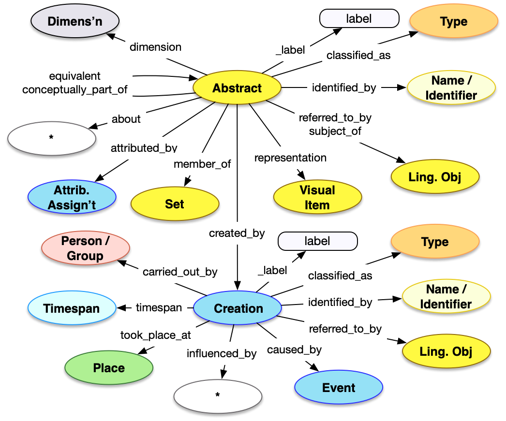

[TOC]

## Introduction

The Abstract Work API is a method of getting access to descriptions of abstract or conceptual works and especially when those works are instantiated by activities rather than physical or digital objects. Examples are the "idea" behind an exhibition, the general concept of a piece of performance art rather than the activity which enacts that idea, or the most general form of a work without specifically being composed of image or language. Abstract works are thus not frequently used but are necessary to connect instances of the work, such as a travelling exhibition or different performances of the same idea.

For more information about the usage of Abstract Work, please see the [Document model](/model/abstract/) description.


## Property Definitions

Dereferencing an entity via the Abstract Work endpoint would result in a JSON-LD document containing a single JSON object with the following properties.

### Properties of Textual Works

| Property Name     | Datatype      | Requirement | Description | 
|-------------------|---------------|-------------|-------------|
| `@context`        | string, array | Required    | The value MUST be the URI of the [Linked Art context](../../json-ld/) as a string, `"https://linked.art/ns/v1/linked-art.json"` or an array in which the URI is the last entry to allow for [extensions](../../json-ld/extensions) | 
| `id`              | string        | Required    | The value MUST be the HTTP(S) URI at which the work's representation can be [dereferenced](../../protocol/) |  
| `type`            | string        | Required    | The class for the work, which MUST be the value `"PropositionalObject"` |
| `_label`          | string        | Recommended | A human readable label for the work, intended for developers |
| `classified_as`   | array         | Recommended | An array of json objects, each of which is a classification of the work and MUST follow the requirements for [Type](../../shared/type/) |
| `identified_by`   | array         | Recommended | An array of json objects, each of which is a name/title of the work and MUST follow the requirements for [Name](../../shared/name/), or an identifier for the work and MUST follow the requirements for [Identifier](../../shared/identifier/) |
| `referred_to_by`  | array         | Optional    | An array of json objects, each of which is a human readable statement about the work and MUST follow the requirements for [Statement](../../shared/statement/) |
| `equivalent`      | array         | Optional    | An array of json objects, each of which is a [reference](../../shared/reference) to an external URI that also identifies the current work |
| `subject_of`      | array         | Optional    | An array of json objects, each of which is a reference to a [Textual Work](../textual_work/), the content of which focuses on the current abstract work, and MUST follow the requirements for a [reference](../../shared/reference/) |
| `representation`  | array         | Optional    | An array of json objects, each of which is a reference to a [Visual Work](../visual_work) that represents the current work, and MUST follow the requirements for a [reference](../../shared/reference/) |
| `member_of`       | array         | Optional    | An array of json objects, each of which is a Set that the current work is a member of and MUST follow the requirements for a [reference](../../shared/reference/) to a Set |
| `attributed_by`   | array         | Optional    | An array of json objects, each of which is a [Relationship Assignment](../../shared/assignment/) that relates the current work to another entity |
| `dimension` | array | Optional | An array of json objects, each of which is an abstract [Dimension](../../shared/dimension) of the current work |
| `conceptually_part_of` | array | Optional | An array of json objects, each of which is a [reference](../../shared/reference/) to another Abstract Work that the current work is conceptually part of |
| `about` | array | Optional | An array of json objects, each of which is a [reference](../../shared/reference/) to another entity of any type, that this work is primarily about | 
| `subject_to` | array | Optional | An array of json objects, each of which is a [Right](../../shared/right) that is held over the intellectual work |
| `created_by` | json object | Optional | A json object representing the creation of the work, which follows the requirements for a [Creation](../../shared/activity) | 

### Property Diagram

> {:.diagram_img width="600px"}

### JSON Schema

See the [schema documentation](../../schema_docs/abstract) and the [schema itself](../../schema/abstract.json)


### Incoming Properties

Abstract Work instances are typically found as the object of the following properties, other than the self-referential properties above.  This list is not exhaustive, but is intended to cover the likely cases where other endpoints refer to texts.

| Property Name              | Source Endpoint | Description |
|----------------------------|-----------------|-------------|
| `about`                    | Textual Work    | Textual works can be about abstract works  |
| `influenced_by`             | Activity        | Activities (such as Exhibitions) can be influenced by the abstract work |
  

## Example

The JSON for an Abstract Work entry for the idea for an exhibition about Gainsborough could be as below.

* It has the Linked Art context document reference in `@context`
* It self-documents its URI in `id`
* It has a `type` of "PropositionalObject"
* It has a `_label` with the value "Gainsborough Exh." for people reading the JSON
* It is `classified_as` an Exhibition, which has an `id` of "aat:300417531"
* It is `identified_by` ...
    * ... a `Name`, with the content "Gainsborough Exhibition"
* It is `referred_to_by` a statement which ...
    * ... has `content` describing the abstract work
    * ... and is `classified_as` an abstract ("aat:300418049")
* It is `about` Gainsborough, a Person with `id` "ulan:500115200"
* It was `created_by` a Creation which ...
    * ... was `carried_out_by` Brett Hayes, a Person


```crom
top = vocab.ExhibitionIdea(ident="auto int-per-segment", label="Gainsborough Exh.")
top.identified_by = vocab.PrimaryName(content="Gainsborough Exhibition")
top.referred_to_by = vocab.Abstract(content="A thorough analysis of the artist's life and work")
top.about = model.Person(ident="http://vocab.getty.edu/ulan/500115200", label="Gainsborough, Thomas")
cre = model.Creation()
cre.carried_out_by = model.Person(ident="http://vocab.getty.edu/ulan/500144588", label="Hayes, Brett")
top.created_by = cre
```
