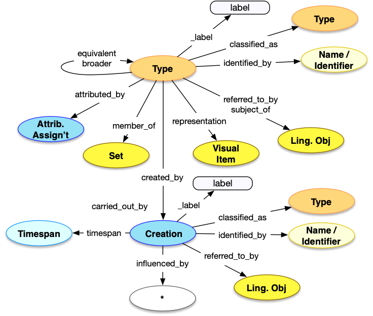

<style>
th, td {
  padding: 5px 5px;
  text-align: left;
  border: 1px solid #D0D0D0; }
th { background: #F0F0F0; }
th:first-child, td:first-child { padding-left: 3px; }
th:last-child, td:last-child { padding-right: 3px; }
</style>

[TOC]

## Introduction

The Concept API is a method of getting access to descriptions of concepts, including Types, Materials, Languages, MeasurementUnits and Currencies. The Concept model is relatively simple with the common properties and patterns, and very few additions. This API endpoint is for full records that describe concepts, rather than references to concepts within other records. For the embedded concept structure, please see the [Type Structure](../../shared/type) page.


## Property Definitions

Dereferencing an entity via the Concept endpoint would result in a JSON-LD document containing a single JSON object with the following properties.

### Properties of Concepts

| Property Name     | Datatype      | Requirement | Description | 
|-------------------|---------------|-------------|-------------|
| `@context`        | string, array | Required    | The value MUST be the URI of the [Linked Art context](../../json-ld/) as a string, `"https://linked.art/ns/v1/linked-art.json"` or an array in which the URI is the last entry to allow for [extensions](../../json-ld/extensions) | 
| `id`              | string        | Required    | The value MUST be the HTTP(S) URI at which the concept's representation can be [dereferenced](../../protocol/) |  
| `type`            | string        | Required    | The class for the concept, which MUST be one of `"Type"`, `"Material"`, `"Language"`, `"Currency"` or `"MeasurementUnit"` |
| `_label`          | string        | Recommended | A human readable label for the concept, intended for developers |
| `classified_as`   | array         | Recommended | An array of json objects, each of which is a classification of the concept and MUST follow the requirements for [Type](../../shared/type/) |
| `identified_by`   | array         | Recommended | An array of json objects, each of which is a name of the concept and MUST follow the requirements for [Name](../../shared/name/), or an identifier for the concept and MUST follow the requirements for [Identifier](../../shared/identifier/) |
| `referred_to_by`  | array         | Optional    | An array of json objects, each of which is a human readable statement about the concept and MUST follow the requirements for [Statement](../../shared/statement/) |
| `equivalent`      | array         | Optional    | An array of json objects, each of which is a [reference](../../shared/reference) to an external identity and description of the concept |
| `representation`  | array         | Optional    | An array of json objects, each of which is a reference to a [Visual Work](../visual_work) that represents the current concept, and MUST follow the requirements for a [reference](../../shared/reference/) |
| `member_of`       | array         | Optional    | An array of json objects, each of which is a Set that the current concept is a member of and MUST follow the requirements for a [reference](../../shared/reference/) to a Set |
| `subject_of`      | array         | Optional    | An array of json objects, each of which is a reference to a [Textual Work](../textual_work/), the content of which focuses on the current concept, and MUST follow the requirements for a [reference](../../shared/reference) |
| `attributed_by`   | array         | Optional    | An array of json objects, each of which is a [Relationship Assignment](../../shared/assignment/) that relates the current concept to another entity |
| `broader`         | array         | Optional    | An array of json objects, each of which is a [reference](../../shared/reference) to another concept which is broader than the current concept |    
| `created_by` | json object | Optional | A json object representing the creation of the concept, which follows the requirements for Creations described below. | 


### Properties of Creations

| Property Name     | Datatype      | Requirement | Description | 
|-------------------|---------------|-------------|-------------|
| `id`              | string        | Optional    | If present, the value MUST be a URI identifying the creation  |  
| `type`            | string        | Required    | The class for the creation, which MUST be the value `"Creation"` |
| `_label`          | string        | Recommended | A human readable label for the creation, intended for developers |
| `identified_by`   | array         | Optional | An array of json objects, each of which is a name for the creation and MUST follow the requirements for [Name](../../shared/name/), or an identifier for the creation and MUST follow the requirements for [Identifier](../../shared/identifier/) |
| `classified_as`   | array         | Optional | An array of json objects, each of which is a further classification of the creation and MUST follow the requirements for [Type](../../shared/type/) |
| `timespan`        | json object   | Optional | A json object recording when the creation occured, which MUST follow the requirements for [timespans](../../shared/timespan/)|
| `referred_to_by`  | array         | Optional    | An array of json objects, each of which is an embedded [statement](../statement/) about the creation |
| `influenced_by`   | array         | Optional    | An array of json objects, each of which is a [reference](../../shared/reference/) to an entity that influenced the creation in some noticable fashion | 


### Property Diagram

> {:.diagram_img width="600px"}

### JSON Schema

See the [schema documentation](../../schema_docs/concept) and the [schema itself](../../schema/concept.json)


### Incoming Properties

Set instances are typically found as the object of the following properties, other than the self-referential properties above.  This list is not exhaustive, but is intended to cover the likely cases where other endpoints refer to concepts.


| Property Name   | Source Class   | Description |
|-----------------|----------------|-------------|
| `classified_as` | All            | Almost every entity can be classified as a Type |
| `technique`     | `Activity`     | Activities (of all sorts) can have a technique, which is modeled as a Type |
| `motivated_by`  | `Activity`     | Activities can also be motivated by a Type |
| `about`         | `LinguisticObject`, `VisualItem` | Textual and Visual Works can have subjects, which are modeled as Types |
| `assigned`      | `AttributeAssignment` | The classification of an object might be assigned as part of a documented Attribute Assignment |
| `language`      | `LinguisticObject`    | The language of linguistic content is modeled as a Language |
| `currency`      | `MonetaryAmount`      | The currency of a MonetaryAmount is modeled as a Currency |
| `unit`          | `Dimension`           | The unit of a Dimension is modeled as a MeasurementUnit |
| `made_of`       | `Material`            | The materials of a HumanMadeObject are modeled as Materials | 


## Example

The JSON for a Concept entry for ... could be as below.

* It has the Linked Art context document reference in `@context`
* It self-documents its URI in `id`
* It has a `type` of "Type"
* It has a `_label` with the value "History of France" for people reading the JSON
* It has an `identified_by` property, with a `Name` that gives is Primary Name of "History of France"
* It has a `member_of` property, conveying that it is a member of a set, with the label "Useful History Concepts"
* It has a `broader` property, conveying that the broader term is a `Type` with the label "History of Europe"
* It has an `equivalent` property, conveying that it is generally equivalent to the LCSH heading sh85051256
* It was created in a `Creation`, which ...
  * ... was `influenced_by` two other entities ...
    * ... a `Type` with the label "History"
    * ... and a `Place` with the label "France"


```crom
top = model.Type(ident="auto int-per-segment", label="History of France")
top.identified_by = vocab.PrimaryName(content="History of France")
top.broader = model.Type(label="History of Europe")
top.member_of = model.Set(label="Useful History Concepts")
top.equivalent = model.Type(ident="http://id.loc.gov/authorities/subjects/sh85051256")
cre = model.Creation(label="Concept Creation")
top.created_by = cre
cre.influenced_by = model.Type(label="History")
cre.influenced_by = model.Place(label="France")
```


