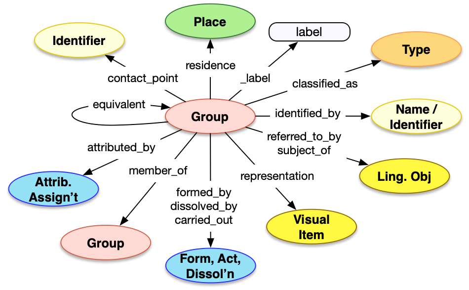

<style>
th, td {
  padding: 5px 5px;
  text-align: left;
  border: 1px solid #D0D0D0; }
th { background: #F0F0F0; }
th:first-child, td:first-child { padding-left: 3px; }
th:last-child, td:last-child { padding-right: 3px; }
</style>

[TOC]

## Introduction

The Group API is a method of getting access to descriptions of sets of people and/or subgroups, such as families, organizations, companies, departments or any other identifiable set of actors.  The Group model is of average complexity with many familiar properties and patterns, plus a few more specific fields.  This results in an average complexity API, which is very similar to the [Person API](../person/), that can result in reasonably long JSON responses if all of the fields have values. 

For more information about the usage of Group data, please see the [Group model](/model/actor/) description.


## Property Definitions

Dereferencing an entity via the Group endpoint would result in a JSON-LD document containing a single JSON object with the following properties.

### Properties of Groups

| Property Name     | Datatype      | Requirement | Description | 
|-------------------|---------------|-------------|-------------|
| `@context`        | string, array | Required    | The value MUST be the URI of the [Linked Art context](../../json-ld/) as a string, `"https://linked.art/ns/v1/linked-art.json"` or an array in which the URI is the last entry to allow for [extensions](../../json-ld/extensions.html) | 
| `id`              | string        | Required    | The value MUST be the HTTP(S) URI at which the group's representation can be [dereferenced](../../protocol/) |  
| `type`            | string        | Required    | The class for the group, which MUST be the value `"Group"` |
| `_label`          | string        | Recommended | A human readable label for the group, intended for developers |
| `classified_as`   | array         | Recommended | An array of json objects, each of which is a classification of the group and MUST follow the requirements for [Type](../../shared/type/) |
| `identified_by`   | array         | Recommended | An array of json objects, each of which is a name of the group and MUST follow the requirements for [Name](../../shared/name/), or an identifier for the group and MUST follow the requirements for [Identifier](../../shared/identifier/) |
| `referred_to_by`  | array         | Optional    | An array of json objects, each of which is a human readable statement about the group and MUST follow the requirements for [Statement](../../shared/statement/) |
| `equivalent`      | array         | Optional    | An array of json objects, each of which is a [reference](../../shared/reference) to an external identity and description of the current group |
| `representation`  | array         | Optional    | An array of json objects, each of which is a reference to a [Visual Work](../visual_work) that represents the current group, and MUST follow the requirements for a [reference](../../shared/reference/) |
| `member_of`       | array         | Optional    | An array of json objects, each of which is a Group that the current group is a member of and MUST follow the requirements for a [reference](../../shared/reference/) to a **[Group](../group/)** |
| `subject_of`      | array         | Optional    | An array of json objects, each of which is a reference to a [Textual Work](../textual_work/), the content of which focuses on the current group, and MUST follow the requirements for a [reference](../../shared/reference) |
| `attributed_by`   | array         | Optional    | An array of json objects, each of which is a [Relationship Assignment](../../shared/assignment/) that relates the current group to another entity |
| `carried_out` | array | Optional | An array of json objects, each of which represents professional activities of the group and follows the requirements for Professional Activities described below. |
| `contact_point` | array | Optional | An array of json objects, each of which is an address at which the group is reachable and MUST follow the requirements for an [Identifier](../../shared/identifier) |
| `residence` | array | Optional | A place that the group was associated with, and MUST follow the requirements for a [reference](../../shared/reference/) to a [Place](../place/) |
| `formed_by` | json object | Optional | A json object representing the formation of the group, which follows the requirements for Formations described below. | 
| `dissolved_by` | json object | Optional | A json object representing the dissolution of the group, which follows the requirements for Dissolutions described below. |


### Properties of Formations, Dissolutions and Professional Activities

| Property Name     | Datatype      | Requirement | Description | 
|-------------------|---------------|-------------|-------------|
| `id`              | string        | Optional    | If present, the value MUST be a URI identifying the formation, dissolution or professional activity  |  
| `type`            | string        | Required    | The class for the birth, death or professional activity, which MUST be the value `"Formation"`, `"Dissolution"`, or `"Activity"` respectively |
| `_label`          | string        | Recommended | A human readable label for the event, intended for developers |
| `identified_by`   | array         | Recommended | An array of json objects, each of which is a name for the event and MUST follow the requirements for [Name](../../shared/name/), or an identifier for the event and MUST follow the requirements for [Identifier](../../shared/identifier/) |
| `classified_as`   | array         | Recommended | An array of json objects, each of which is a further classification of the event and MUST follow the requirements for [Type](../type/) |
| `timespan`        | json object   | Recommended | A json object recording when the event occured, which MUST follow the requirements for [timespans](../timespan/)|
| `referred_to_by`  | array         | Optional    | An array of json objects, each of which is an embedded [statement](../statement/) about the event |
| `took_place_at`   | array         | Optional    | An array of json objects, each of which is a [reference](../../shared/reference/) to a [Place](../place/) where the event occured |
| `caused_by`       | array         | Optional    | An array of json objects, each of which is a [reference](../../shared/reference/) to an [Event](../event/) that caused the current event to occur |
| `influenced_by`   | array         | Optional    | An array of json objects, each of which is an [entity referece](../../shared/reference/) to an entity that influenced the event in some noticable fashion | 


### Property Diagram

> {:.diagram_img width="600px"}

### JSON Schema

See the [schema documentation](../../schema_docs/group.html) and the [schema itself](../../schema/group.json)


### Incoming Properties

Group instances are typically found as the object of the following properties, other than the self-referential properties above.  This list is not exhaustive, but is intended to cover the likely cases where other endpoints refer to groups.

| Property Name              | Source Endpoint | Description |
|----------------------------|-----------------|-------------|
| `member_of`                | [Person](../person/), [Group](../group/)   | People that are members of the current Group are recorded in the Person record |
| `carried_out_by`           | All             | An activity that the Group carried out |
| `current_owner`            | [Object](../physical_object/) | An object owned by the Group |
| `current_custodian`        | [Object](../physical_object/) | An object in the custody of the Group |
| `current_permanent_custodian` | [Object](../physical_object/) | An object that is normally in the custody of the Group |
| `represents`               | [Visual Work](../visual_work/)     | Image content which represents the Group (the inverse of `representation`) |
| `about`                    | [Textual Work](../textual_work/)    | Textual content that is about the Group |
| `transferred_custody_to`   | [Provenance](../provenance_activity/)     | The activity of transferring custody of an object to the Group |
| `transferred_custody_from` | [Provenance](../provenance_activity/)     | The activity of transferring custody of an object away from the Group |
| `transferred_title_to`     | [Provenance](../provenance_activity/)     | The activity of transferring ownership of an object to the Group |
| `transferred_title_from`   | [Provenance](../provenance_activity/)     | The activity of transferring ownership of an object away from the Group |
| `paid_to`                  | [Provenance](../provenance_activity/)     | The activity of paying money to the Group from someone else |
| `paid_from`                | [Provenance](../provenance_activity/)    | The activity of paying money from the Group to someone else |


## Example

The JSON for a Group entry for the Camden Town Group could be as below.

* It has the Linked Art context document reference in `@context`
* It self-documents its URI in `id`
* It has a `type` of "Group"
* It has a `_label` with the value "Camden Town Group" for people reading the JSON
* It is `classified_as` ...
    * ... a "Society", which has an `id` of "aat:300026009"
    * ... "British", which as an `id` of "aat:300111159" and a meta-type of "Nationality", which has an `id` of "aat:300379842"
* It is `identified_by` a `Name`, with the content "Camden Town Group", and `language` of English ("aat:300388277")
* It is `referred_to_by` a statement which ...
    * ... has `content` of "A group of British painters formed in 1911 ..."
    * ... is `classified_as` a Biography ("aat:300435422")
* It `carried_out` its professional activities ...
    * ... in a `timespan` between "1911-01-01" and "1913-12-31"
* It is `attributed_by` an "AttributeAssignment" relationship
    * ... to the London Group, with `id` "ulan:500117319"
* It has a `residence` of London
* It is `equivalent` to the ULAN entry `"ulan:500117318"
* It was `formed_by` a Formation which ...
    * ... `took_place_at` London
    * ... in a `timespan` between "1911-01-01" and "1911-12-31"
* It was `dissolved_by` a Dissolution which ...
    * ... `took_place_at` London again
    * ... in a `timespan` between "1913-01-01" and "1913-12-31"  

```crom
top = model.Group(ident="auto int-per-segment", label="Camden Town Group")
n = model.Name(content="Camden Town Group")
n.language = model.Language(ident="http://vocab.getty.edu/aat/300388277", label="English")
top.identified_by = n

top.classified_as = model.Type(ident="http://vocab.getty.edu/aat/300026009", label="Society")
top.classified_as = vocab.instances['british nationality']

b = model.Formation(label="Formation of the Group")
ts = model.TimeSpan()
ts._label = "1911"
ts.begin_of_the_begin = "1911-01-01T00:00:00Z"
ts.end_of_the_end = "1911-12-31T23:59:59Z"
b.timespan = ts
p = model.Place(label="London")
b.took_place_at = p
top.formed_by = b

d = model.Dissolution(label="Dissolution of the Group")
ts = model.TimeSpan()
ts._label = "1913"
ts.begin_of_the_begin = "1913-01-01T00:00:00Z"
ts.end_of_the_end = "1913-12-31T23:59:59Z"
d.timespan = ts
d.took_place_at = p
top.dissolved_by = d

top.referred_to_by = vocab.BiographyStatement(
	content="A group of British painters formed in 1911; although it only lasted two years, its name is used in a broader sense to characterize a particular strain of British painting from about 1905 to 1920.")

act = vocab.Active(label="Active Dates")
ts = model.TimeSpan()
ts.begin_of_the_begin = "1911-01-01T00:00:00Z"
ts.end_of_the_end = "1913-12-31T23:59:59Z"
act.timespan = ts
top.carried_out = act

top.residence = p
top.equivalent = model.Group(ident="http://vocab.getty.edu/ulan/500117318", label="Camden Town Group")

aa = model.AttributeAssignment(label="Related Group")
aa.assigned = model.Group(ident="http://vocab.getty.edu/ulan/500117319", label="London Group")
top.attributed_by = aa

```
