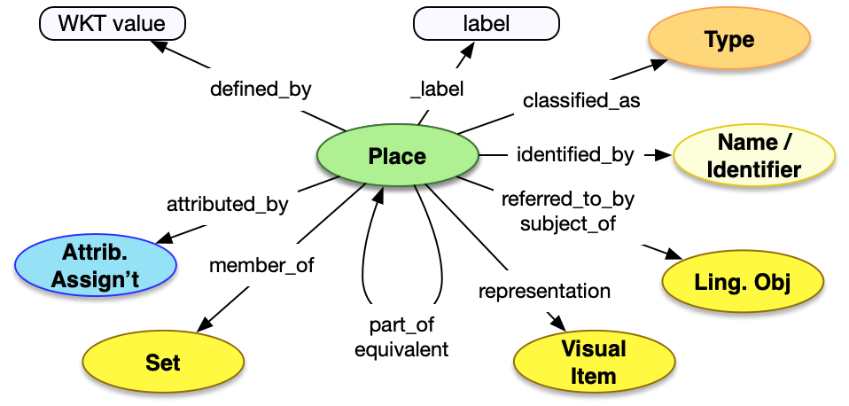

<style>
th, td {
  padding: 5px 5px;
  text-align: left;
  border: 1px solid #D0D0D0; }
th { background: #F0F0F0; }
th:first-child, td:first-child { padding-left: 3px; }
th:last-child, td:last-child { padding-right: 3px; }
</style>

[TOC]

## Introduction

Places are a foundational aspect of the Linked Art model for providing context as to where activities occur. They are extents in space described by a geometry, and independent of time or what object(s) may be present at the location. Places are a relatively simple model and therefore a relatively simple API, using the shared features and common patterns, along with a WKT based definition of the geometry.

For more information about the usage of Places, please see the [Place model](/model/place/).

## Property Definitions

Dereferencing an entity via the Place endpoint would result in a JSON-LD document with a JSON object with the following properties.

### Properties of Places

| Property Name     | Datatype      | Requirement | Description | 
|-------------------|---------------|-------------|-------------|
| `@context`        | string, array | Required    | The value MUST be the URI of the [Linked Art context](../../json-ld/) as a string, `"https://linked.art/ns/v1/linked-art.json"` or an array in which the URI is the last entry to allow for [extensions](../../json-ld/extensions.html) | 
| `id`              | string        | Required    | The value MUST be the HTTP(S) URI at which the place's representation can be [dereferenced](../../protocol/) |  
| `type`            | string        | Required    | The class of the place, which MUST be the value `"Place"` |
| `_label`          | string        | Recommended | A human readable label for the place, intended for developers |
| `classified_as`   | array         | Recommended | An array of json objects, each of which is a classification of the Place and MUST follow the requirements for [Type](../../shared/type/) |
| `identified_by`   | array         | Recommended | An array of json objects, each of which is a name of the Place and MUST follow the requirements for [Name](../../shared/name/), or an identifier for the Place and MUST follow the requirements for [Identifier](../../shared/identifier/) |
| `referred_to_by`  | array         | Optional    | An array of json objects, each of which is a human readable statement about the Place and MUST follow the requirements for [Statement](../../shared/statement/) |
| `defined_by`      | string        | Optional    | A string containing the [WKT](https://en.wikipedia.org/wiki/Well-known_text_representation_of_geometry) representation of the geometry of the Place |
| `approximated_by` | array         | Optional    | An array of json objects, each of which is an approximation of the current Place and MUST follow the requirements for an [entity reference](../../shared/reference/) to a Place |
| `part_of`         | array         | Optional    | An array of json objects, each of which is a Place that the current Place falls within and MUST follow the requirements for an [entity reference](../../shared/reference/) to a Place |
| `member_of`       | array         | Optional    | An array of json objects, each of which is a Set that the current Place is a member of and MUST follow the requirements for an [entity reference](../../shared/reference/) to a [Set](../../endpoint/set/) |

### Property Diagram

> {:.diagram_img width="600px"}


### Incoming Properties

Type instances are typically found as the object of the following properties, other than the self-referential properties above.  This list is not exhaustive, but is intended to cover the likely cases where other endpoints refer to Places.

| Property Name      | Source Endpoint | Description |
|--------------------|-----------------|-------------|
| `current_location` | [Physical Object](../physical_object/) | The current location of an object is managed by the object |
| `current_permanent_location` | [Physical Object](../physical_object/) | The normal location of the object is also managed by the object |
| `moved_from`       | [Provenance Activity](../provenance_activity/) | In Provenance Activities, objects can be moved in a `Move` activity from one place ...| 
| `moved_to`         | [Provenance Activity](../provenance_activity/) | ... to another place |
| `residence`        | [Person](../person/), [Group](../group/) | People and Groups have Places at which they are or have been resident |
| `took_place_at`    | All | All Events and Activities can take place at a Place, which appear in most of the endpoints such as the location of the birth of a person, or the location of the assignment of an identifier  |

## Example

The JSON for a Place entry for the city of Los Angeles could be as below.

* It has the Linked Art context document reference in `@context`
* It self-documents its URI in `id`
* It has a `type` of "Place"
* It has a `_label` with the value "Los Angeles" for humans reading the JSON
* It is `classified_as` a city, which has an `id` of _aat:300008389_, a `type` of Type, and a label. 
* It is `identified_by` a `Name`, with the `content` "Los Angeles"
* It is `identified_by` an `Identifier`, with the `content` "06-44000"
* It is `defined_by` a particular WKT Polygon
* It is `referred_to_by` a `LinguisticObject`, which is `classified_as` a Description (_aat:300411780_), and has `content` of "Los Angeles is the largest city in California"
* It is `approximated_by` another `Place`, which is the centroid of Los Angeles
* It is `part_of` another `Place`, which is the state California
* It is a `member_of` the `Set` of top 10 cities in the USA


```crom
top = vocab.City(label="Los Angeles")
top.identified_by = model.Name(content="Los Angeles")
top.identified_by = model.Identifier(content="06-44000")
top.referred_to_by = vocab.Description(content="Los Angeles is the largest city in California")
top.defined_by = "POLYGON((-118.574 34.185,-117.558 34.185,-117.5585 33.512,-118.574 33.512,-118.5745 34.185))"
top.approximated_by = model.Place(label="Los Angeles Centroid")
top.part_of = model.Place(label="California")
top.member_of = model.Set(label="Top 10 Cities in USA")
```


### Incoming Reference Example

A [Physical Object](../physical_object/) referring to two places via the `current_location` and the location that it was created.

```crom
top = model.HumanMadeObject(label="Van Gogh Painting")
top.current_location = model.Place(label="Rijksmuseum Gallery")
top.produced_by = model.Production(label="Production of Painting")
top.produced_by.took_place_at = model.Place(label="Amsterdam")
```
