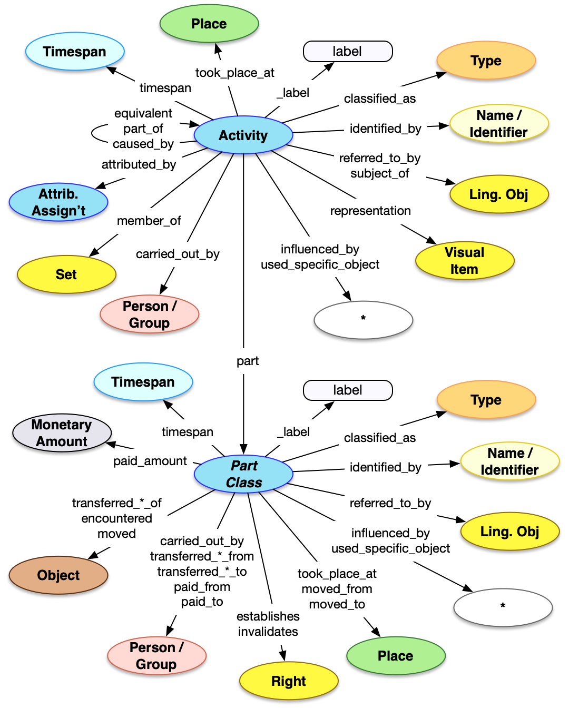

## Introduction

The Provenance Activity API is a method of getting access to descriptions of ... The API is of higher than average complexity with many familiar properties and patterns, but also with a series of classes which convey parts of the higher level activity, each with their own unique properties.

## Property Definitions

Dereferencing an entity via the Provenance Activity endpoint would result in a JSON-LD document containing a single JSON object with the following properties.

### Properties of Provenance Activities

The top level Activity has the following properties.

| Property Name     | Datatype      | Requirement | Description | 
|-------------------|---------------|-------------|-------------|
| `@context`        | string, array | Required    | The value MUST be the URI of the [Linked Art context](../../json-ld/) as a string, `"https://linked.art/ns/v1/linked-art.json"` or an array in which the URI is the last entry to allow for [extensions](../../json-ld/extensions) | 
| `id`              | string        | Required    | The value MUST be the HTTP(S) URI at which the event's representation can be [dereferenced](../../protocol/) |  
| `type`            | string        | Required    | The class for the event, which MUST be the value `"Event"` or the value `"Activity"` |
| `_label`          | string        | Recommended | A human readable label for the event, intended for developers |
| `classified_as`   | array         | Required    | An array of json objects, each of which is a classification of the event and MUST follow the requirements for [Type](../../shared/type/) |
| `identified_by`   | array         | Recommended | An array of json objects, each of which is a name/title of the event and MUST follow the requirements for [Name](../../shared/name/), or an identifier for the event and MUST follow the requirements for [Identifier](../../shared/identifier/) |
| `referred_to_by`  | array         | Optional    | An array of json objects, each of which is a human readable statement about the event and MUST follow the requirements for [Statement](../../shared/statement/) |
| `equivalent`      | array         | Optional    | An array of json objects, each of which is a [reference](../../shared/reference) to an external identity and description of the current event |
| `representation`  | array         | Optional    | An array of json objects, each of which is a reference to a [Visual Work](../visual_work) that represents the current event, and MUST follow the requirements for a [reference](../../shared/reference/) |
| `member_of`       | array         | Optional    | An array of json objects, each of which is a Set that the current event is a member of and MUST follow the requirements for a [reference](../../shared/reference/) to a Set |
| `subject_of`      | array         | Optional    | An array of json objects, each of which is a reference to a [Textual Work](../textual_work/), the content of which focuses on the current event, and MUST follow the requirements for a [reference](../../shared/reference/) |
| `attributed_by`   | array         | Optional    | An array of json objects, each of which is a [Relationship Assignment](../../shared/assignment/) that relates the current event to another entity |
| `part_of` | array | Optional | An array of json objects, each of which is a [reference](../../shared/reference/) to another event that the current event is a part of. |
| `timespan`        | json object   | Recommended | A json object recording when the event occured, which MUST follow the requirements for [timespans](../../shared/timespan/)|
| `during`          | array         | Optional    | An array of json objects, each of which is a [reference](../../shared/reference) to a [Period](../event/) during which the provenance activity occured |
| `before`          | array         | Optional    | An array of json objects, each of which is a [reference](../../shared/reference) to a Period, Event or Activity before which this event occured |
| `after`          | array         | Optional    | An array of json objects, each of which is a [reference](../../shared/reference) to a Period, Event or Activity after which this event occured |
| `took_place_at`   | array         | Optional    | An array of json objects, each of which is a [reference](../../shared/reference/) to a [Place](../place/) where the event occured |
| `caused_by`       | array         | Optional    | An array of json objects, each of which is a [reference](../../shared/reference/) to an [Event](../event/) that caused the event to occur |
| `influenced_by`   | array         | Optional    | An array of json objects, each of which is a [reference](../../shared/reference/) to an entity that influenced the event in some noticable fashion | 
| `carried_out_by`  | array         | Optional    | An array of json objects, each of which is a [reference](../../shared/reference/) to a [Person](../person/) or [Group](../group/) that carried out the activity |
| `participant`  | array         | Optional    | An array of json objects, each of which is a [reference](../../shared/reference/) to a [Person](../person/) or [Group](../group/) that participated in the activity but did not carry it out. |
| `used_specific_object` | array    | Optional    | An array of json objects, each of which is a [reference](../../shared/reference)] to an entity that was instrumental in the carrying out of the activity |
| `part` | array | Required | The more detailed changes that the activity consists of, described below|


#### Required Classification

In order to determine that the activity is a Provenance Activity, rather than a more general Event or Activity, which would follow the [event](../event/) API instead, the Activity MUST have a `classified_as` entry with an `id` of `"http://vocab.getty.edu/aat/300055863"`.

```crom
top = vocab.ProvenanceEntry(ident="auto int-per-segment", label="Provenance Activity")
```


### Properties of All Parts

Each of the activities in the `part` property can have the properties in the table below.  The different classes of activity have their own `type` and other properties, which are defined in the following subsections.

| Property Name     | Datatype      | Requirement | Description | 
|-------------------|---------------|-------------|-------------|
| `id`              | string        | Optional    | If present, the value MUST be a URI identifying the provenance part activity  |  
| `type`            | string        | Required    | The class for the part, which MUST be the value given in the subsections below |
| `_label`          | string        | Recommended | A human readable label for the provenance part, intended for developers |
| `identified_by`   | array         | Recommended | An array of json objects, each of which is a name for the provenance part and MUST follow the requirements for [Name](../../shared/name/), or an identifier for the part and MUST follow the requirements for [Identifier](../../shared/identifier/) |
| `classified_as`   | array         | Recommended | An array of json objects, each of which is a further classification of the provenance part and MUST follow the requirements for [Type](../../shared/type/) |
| `referred_to_by`  | array         | Optional    | An array of json objects, each of which is an embedded [statement](../statement/) about the part |
| `timespan`        | json object   | Recommended | A json object recording when the part occured, which MUST follow the requirements for [timespans](../../shared/timespan/)|
| `during`          | array         | Optional    | An array of json objects, each of which is a [reference](../../shared/reference) to a [Period](../event/) during which the part activity occured | 
| `took_place_at`   | array         | Optional    | An array of json objects, each of which is a [reference](../../shared/reference/) to a [Place](../place/) where the part activity occured |
| `influenced_by`   | array         | Optional    | An array of json objects, each of which is a [reference](../../shared/reference/) to an entity that influenced the part activity in some noticable fashion, but did not carry it out | 
| `carried_out_by`  | array         | Optional    | An array of json objects, each of which is a [reference](../../shared/reference/) to a [Person](../person/) or [Group](../group/) that carried out the part activity |
| `participant`  | array         | Optional    | An array of json objects, each of which is a [reference](../../shared/reference/) to a [Person](../person/) or [Group](../group/) that participated in the part activity but did not carry it out |
| `used_specific_object` | array    | Optional    | An array of json objects, each of which is a [reference](../../shared/reference)] to an entity that was instrumental in the carrying out of the part activity |

#### Properties of Part: Acquisition

Parts which are Acquisitions have the following additional properties.

| Property Name     | Datatype      | Requirement | Description | 
|-------------------|---------------|-------------|-------------|
| `type`            | string        | Required    | The class for the part, which MUST be the value `"Acquisition"` |
| `transferred_title_of`   | array | Required | An array of json objects, each of which is a [reference](../../shared/reference) to the [Object](../object/) of which the ownership is transferred |
| `transferred_title_from` | array       | Optional | An array of json objects, each of which is a [reference](../../shared/reference) to a [Person](../person/) or [Group](../group/), each of which was a previous owner of the object, and from whom the object's ownership was transferred |
| `transferred_title_to`   | array       | Optional | An array of json objects, each of which is a [reference](../../shared/reference) to a [Person](../person/) or [Group](../group/), each of which is one of the new owners to whom the object's ownership was transferred |


#### Properties of Part: Payment

Parts which are Payments have the following additional properties.

| Property Name     | Datatype    | Requirement | Description | 
|-------------------|-------------|-------------|-------------|
| `type`            | string      | Required | The class for the part, which MUST be the value `"Payment"` |
| `paid_amount`     | json object | Optional | A [Monetary Amount](../../shared/money/) structure encoding the amount that was transferred |
| `paid_from`       | array       | Optional | An array of json objects, each of which is a [reference](../../shared/reference) to a [Person](../person/) or [Group](../group/), each of which provided some part of the monetary amount |
| `paid_to`         | array       | Optional | An array of json objects, each of which is a [reference](../../shared/reference) to a [Person](../person/) or [Group](../group/), each of which received some part of the monetary amount |

#### Properties of Part: Transfer of Custody

Parts which are Transfers of Custody have the following additional properties.

| Property Name     | Datatype       | Requirement | Description | 
|-------------------|----------------|-------------|-------------|
| `type`            | string         | Required    | The class for the part, which MUST be the value `"TransferOfCustody"` |
| `transferred_custody_of`   | array | Required    | An array of json objects, each of which is a [reference](../../shared/reference) to the [Object](../object/) of which the custody is transferred |
| `transferred_custody_from` | array | Optional    | An array of json objects, each of which is a [reference](../../shared/reference) to a [Person](../person/) or [Group](../group/), each of which was a previous custodian of the object, and from whom the object's custody was transferred|
| `transferred_custody_to`   | array | Optional    | An array of json objects, each of which is a [reference](../../shared/reference) to a [Person](../person/) or [Group](../group/), each of which was a previous custodian of the object, and from whom the object's custody was transferred|

#### Properties of Part: Encounter 

Parts which are Encounters have the following additional properties.

| Property Name     | Datatype      | Requirement | Description | 
|-------------------|---------------|-------------|-------------|
| `type`            | string        | Required    | The class for the part, which MUST be the value `"Encounter"` |
| `encountered`     | array         | Required    | An array of json objects, each of which is a [reference](../../shared/reference) to the [Object](../object/) which was encountered |

#### Properties of Part: Right Acquisition

Parts which are Right Acquisitions have the following additional properties.

| Property Name     | Datatype      | Requirement | Description | 
|-------------------|---------------|-------------|-------------|
| `type`            | string        | Required    | The class for the part, which MUST be the value `"RightAcquisition"` |
| `establishes`     | array         | Required    | An array of json objects, each of which is a `Right` structure, described below |
| `invalidates`     | array         | Optional    | An array of json objects, each of which is a `Right` structure, described below |

#### Properties of Part: Move

Parts which are Moves have the following additional properties.

| Property Name     | Datatype      | Requirement | Description | 
|-------------------|---------------|-------------|-------------|
| `type`            | string        | Required    | The class for the part, which MUST be the value `"Move"` |
| `moved`           | array         | Required    | An array of json objects, each of which is a [reference](../../shared/reference) to an [Object](../object) that was moved by this activity |
| `moved_from`      | json object   | Optional    | An [reference](../../shared/reference/) to a [Place](../place/) where all of the objects were moved from |
| `moved_to`        | json object   | Optional    | An [reference](../../shared/reference/) to a [Place](../place/) where all of the objects where moved to |


#### Properties of Part: Promise

Parts which are Promises have the following additional properties.

| Property Name     | Datatype      | Requirement | Description | 
|-------------------|---------------|-------------|-------------|
| `type`            | string        | Required    | The class for the part, which MUST be the value `"Activity"` |
| `classified_as`   | array         | Required    | An array of json objects, each of which is a further classification of the creation or publication and MUST follow the requirements for [Type](../../shared/type/), and one entry in the array MUST have have an `id` with the value "http://vocab.getty.edu/aat/300435599", in order to distinguish this activity as a promise |

#### Properties of Part: Transfer

Parts which are unknown types of Transfer have the following additional properties.

| Property Name     | Datatype      | Requirement | Description |
|-------------------|---------------|-------------|-------------|
| `type`            | string        | Required    | The class for the part, which MUST be the value `"Transfer"` |
| `transferred`   | array | Required | An array of json objects, each of which is a [reference](../../shared/reference) to the [Object](../object/) which was somehow transferred |
| `transferred_from` | array       | Optional | An array of json objects, each of which is a [reference](../../shared/reference) to a [Person](../person/) or [Group](../group/), from whom the object was transferred |
| `transferred_to`   | array       | Optional | An array of json objects, each of which is a [reference](../../shared/reference) to a [Person](../person/) or [Group](../group/), to whom the object was transferred |


### Properties of Rights

| Property Name     | Datatype      | Requirement | Description | 
|-------------------|---------------|-------------|-------------|
| `id`              | string        | Optional    | If present, the value MUST be a URI identifying the right  |  
| `type`            | string        | Required    | The class for the right, which MUST be the value `"Right"` |
| `_label`          | string        | Recommended | A human readable label for the right, intended for developers |
| `identified_by`   | array         | Recommended | An array of json objects, each of which is a name for the right and MUST follow the requirements for [Name](../../shared/name/), or an identifier for the right and MUST follow the requirements for [Identifier](../../shared/identifier/) |
| `classified_as`   | array         | Recommended | An array of json objects, each of which is a further classification of the right and MUST follow the requirements for [Type](../../shared/type/) |
| `referred_to_by`  | array         | Optional    | An array of json objects, each of which is an embedded [statement](../statement/) about the right |
| `dimension`       | array         | Optional    | An array of json objects, each of which is [Dimension](../../shared/dimension/) structure |
| `possessed_by`    | array         | Optional    | An array of json objects, each of which is a [reference](../../shared/reference) to a [Person](../person/) or [Group](../group/) that possessed the right |
| `applies_to`      | array         | Optional    | An array of json objects, each of which is a [reference](../../shared/reference) to an [Object](../object) that the right pertains to |
| `part`            | array         | Optional    | An array of json objects, each of which is a right, and MUST follow the requirements of this definition of rights |


### Property Diagram

> {:.diagram_img width="600px"}

### JSON Schema

See the [schema documentation](../../schema_docs/provenance) and the [schema itself](../../schema/provenance.json)


### Incoming Properties

Provenance Activities do not have any incoming references in the current set of APIs, instead they link out to many different entities.


## Example

The JSON for a Provenance Activity describing an the purchase of an object in 1820 at auction could be as below.

* It has the Linked Art context document reference in `@context`
* It self-documents its URI in `id`
* It has a `type` of "Activity" 
* It has a `_label` with the value "St George from Simpson to Adams" for people reading the JSON
* It is `classified_as` a "Provenance Entry", which has an `id` of "aat:300055863"
* It is `identified_by` ...
    * ... a `Name`, with the content "Purchase of Lot 0055a, Durer's St George and the Dragon"
    * ... and an `Identifier`, with the content "0055a"
* It has a `timespan` between "1820-03-09T00:00:00Z" and "1820-03-09T23:59:59Z"
* It `took_place_at` London
* It `used_specific_object` of the auction lot, a Set which would have the object as a member
* It consists of two `part` entries:
    * An Acquisition which ...
        * ... `transferred_title_of` the object,
        * ... `transferred_title_from` a Person called Simpson (the seller),
        * ... and `transferred_title_to` a Person called Adams (the buyer)
    * A Payment which ...
        * ... `paid_amount` of 8.8 British Pounds ("aat:300411998")
        * ... was `paid_from` Adams 
        * ... was `paid_to` Simpson

```crom
top = vocab.ProvenanceEntry(ident="auto int-per-segment", label="St George from Simpson to Adams")
top.identified_by = model.Name(content="Purchase of Lot 0055a, Durer's St George and the Dragon")
top.identified_by = model.Identifier(content="0055a")
ts = model.TimeSpan(label="1820 Mar 09")
ts.begin_of_the_begin = "1820-03-09T00:00:00Z"
ts.end_of_the_end = "1820-03-09T23:59:59Z"
top.timespan = ts
top.carried_out_by = model.Group(ident="http://vocab.getty.edu/ulan/500451765", label="Edward Foster & Son")
top.took_place_at = model.Place(ident="http://vocab.getty.edu/tgn/7011781", label="London")
top.caused_by = model.Activity(ident="http://example.org/auction/Br1908/0055", label="Auction of Lot 0055")
top.used_specific_object = model.Set(ident="http://example.org/set/Br1908/0055", label="Set of Objects for Lot 0055")

what = model.HumanMadeObject(ident="http://example.museum/object/1", label="St George and the Dragon")
buyer = model.Person(ident="http://example.museum/person/1", label="Adams")
seller = model.Person(ident="http://example.museum/person/2", label="Simpson")
amnt = model.MonetaryAmount(label="8.8 pounds")
amnt.value = 8.8
amnt.currency = vocab.instances['gb pounds']

acq = model.Acquisition()
top.part = acq
pay = model.Payment()
top.part = pay

acq.transferred_title_of = what
acq.transferred_title_from = seller
acq.transferred_title_to = buyer
pay.paid_amount = amnt
pay.paid_from = buyer
pay.paid_to = seller

```
