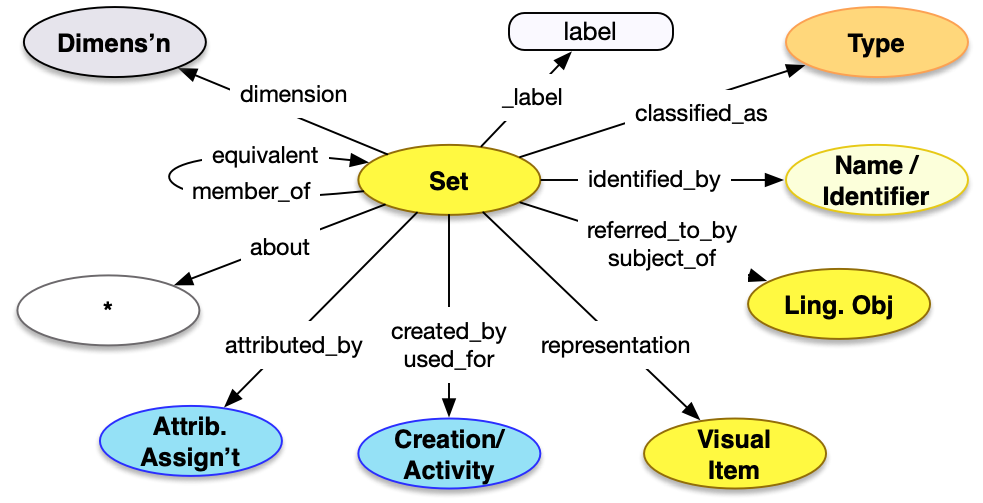

<style>
th, td {
  padding: 5px 5px;
  text-align: left;
  border: 1px solid #D0D0D0; }
th { background: #F0F0F0; }
th:first-child, td:first-child { padding-left: 3px; }
th:last-child, td:last-child { padding-right: 3px; }
</style>

[TOC]

## Introduction

The Set API is a method of getting access to descriptions of sets or collections of any sort of entity, including especially objects, texts and images.  The Set model is relatively simple with the common properties and patterns, and very few additions. It must be noted that, like the [Group API](../group/), the Set API does not list its members, to avoid the potential for very long lists. Instead the individual entities are members of the set, and discovering others is left to APIs to be determined.

For more information about the usage of Set data, please see the [Collection model](/model/collection/) description.


## Property Definitions

Dereferencing an entity via the Set endpoint would result in a JSON-LD document containing a single JSON object with the following properties.

### Properties of Sets

| Property Name     | Datatype      | Requirement | Description | 
|-------------------|---------------|-------------|-------------|
| `@context`        | string, array | Required    | The value MUST be the URI of the [Linked Art context](../../json-ld/) as a string, `"https://linked.art/ns/v1/linked-art.json"` or an array in which the URI is the last entry to allow for [extensions](../../json-ld/extensions) | 
| `id`              | string        | Required    | The value MUST be the HTTP(S) URI at which the set's representation can be [dereferenced](../../protocol/) |  
| `type`            | string        | Required    | The class for the set, which MUST be the value `"Set"` |
| `_label`          | string        | Recommended | A human readable label for the set, intended for developers |
| `classified_as`   | array         | Recommended | An array of json objects, each of which is a classification of the set and MUST follow the requirements for [Type](../../shared/type/) |
| `identified_by`   | array         | Recommended | An array of json objects, each of which is a name of the set and MUST follow the requirements for [Name](../../shared/name/), or an identifier for the set and MUST follow the requirements for [Identifier](../../shared/identifier/) |
| `referred_to_by`  | array         | Optional    | An array of json objects, each of which is a human readable statement about the set and MUST follow the requirements for [Statement](../../shared/statement/) |
| `equivalent`      | array         | Optional    | An array of json objects, each of which is a [reference](../../shared/reference) to an external identity and description of the current set |
| `representation`  | array         | Optional    | An array of json objects, each of which is a reference to a [Visual Work](../visual_work) that represents the current set, and MUST follow the requirements for a [reference](../../shared/reference/) |
| `member_of`       | array         | Optional    | An array of json objects, each of which is a Set that the current set is a member of and MUST follow the requirements for a [reference](../../shared/reference/) to a Set |
| `subject_of`      | array         | Optional    | An array of json objects, each of which is a reference to a [Textual Work](../textual_work/), the content of which focuses on the current set, and MUST follow the requirements for a [reference](../../shared/reference) |
| `attributed_by`   | array         | Optional    | An array of json objects, each of which is a [Relationship Assignment](../../shared/assignment/) that relates the current set to another entity |
| `dimension`       | array | Optional | An array of json objects, each of which is a [Dimension](../../shared/dimension), such as total number of members, of the current set |
| `created_by`      | json object | Optional | A json object representing the creation of the set, which follows the requirements for Creations described below | 
| `used_for`        | array | Optional | An array of json objects, each of which is a Publication or similar Activity which follows the requirements for Publications below | 


### Properties of Creations, Publications or other Activities

| Property Name     | Datatype      | Requirement | Description | 
|-------------------|---------------|-------------|-------------|
| `id`              | string        | Optional    | If present, the value MUST be a URI identifying the creation or activity  |  
| `type`            | string        | Required    | The class for the creation or activity, which MUST be the value `"Creation"` or `"Activity"` |
| `_label`          | string        | Recommended | A human readable label for the creation, intended for developers |
| `identified_by`   | array         | Recommended | An array of json objects, each of which is a name for the creation or activity and MUST follow the requirements for [Name](../../shared/name/), or an identifier for the creation and MUST follow the requirements for [Identifier](../../shared/identifier/) |
| `classified_as`   | array         | Recommended | An array of json objects, each of which is a further classification of the creation or activity and MUST follow the requirements for [Type](../../shared/type/) |
| `timespan`        | json object   | Recommended | A json object recording when the creation or activity occured, which MUST follow the requirements for [timespans](../../shared/timespan/)|
| `referred_to_by`  | array         | Optional    | An array of json objects, each of which is an embedded [statement](../statement/) about the creation or activity |
| `took_place_at`   | array         | Optional    | An array of json objects, each of which is a [reference](../../shared/reference/) to a [Place](../place/) where the creation or activity occured |
| `caused_by`       | array         | Optional    | An array of json objects, each of which is a [reference](../../shared/reference/) to an [Event](../event/) that caused the creation or activity to occur |
| `influenced_by`   | array         | Optional    | An array of json objects, each of which is a [reference](../../shared/reference/) to an entity that influenced the creation or activity in some noticable fashion | 
| `carried_out_by`  | array         | Optional    | An array of json objects, each of which is a [reference](../../shared/reference/) to a [Person](../person/) or [Group](../group/) that carried out the creation or activity |


### Property Diagram

> {:.diagram_img width="600px"}

### JSON Schema

See the [schema documentation](../../schema_docs/set) and the [schema itself](../../schema/set.json)


### Incoming Properties

Set instances are typically found as the object of the following properties, other than the self-referential properties above.  This list is not exhaustive, but is intended to cover the likely cases where other endpoints refer to sets.

| Property Name              | Source Endpoint | Description |
|----------------------------|-----------------|-------------|
| `member_of`                | All             | Entities other than People or Groups can be members of sets. (People and Groups are members of Groups instead) |
| `used_specific_object`     | [Event](../event/) | [Events](../event/) can use sets of things, for example the set of objects in an exhibition or auction lot |


## Example

The JSON for a Set entry for the Met's Collection could be as below.

* It has the Linked Art context document reference in `@context`
* It self-documents its URI in `id`
* It has a `type` of "Set"
* It has a `_label` with the value "Collection of the Met" for people reading the JSON
* It is `classified_as` a "Collection", which has an `id` of "aat:300025976"
* It is `identified_by` a `Name`, with the content "Art Collection of the Metropolitan Museum of Art"
* It is `referred_to_by` a statement which ...
    * ... has `content` of "Over 2 million works ..."
    * ... is `classified_as` a Description ("aat:300435416")
* It was `created_by` a Creation which ...
    * ... has a `timespan` between "1870-04-13T00:00:00Z" and "1870-04-13T23:59:59Z"


```crom
top = vocab.CollectionSet(ident="auto int-per-segment", label="Collection of the Met")
n = model.Name(content="Art Collection of the Metropolitan Museum of Art")
top.identified_by = n
top.referred_to_by = vocab.Description(content="Over 2 million works, divided into 17 curatorial departments")
cre = model.Creation()
ts = model.TimeSpan()
ts._label = "April 13th, 1870"
ts.begin_of_the_begin = "1870-04-13T00:00:00Z"
ts.end_of_the_end = "1870-04-13T23:59:59Z"
cre.timespan = ts
top.created_by = cre
```

