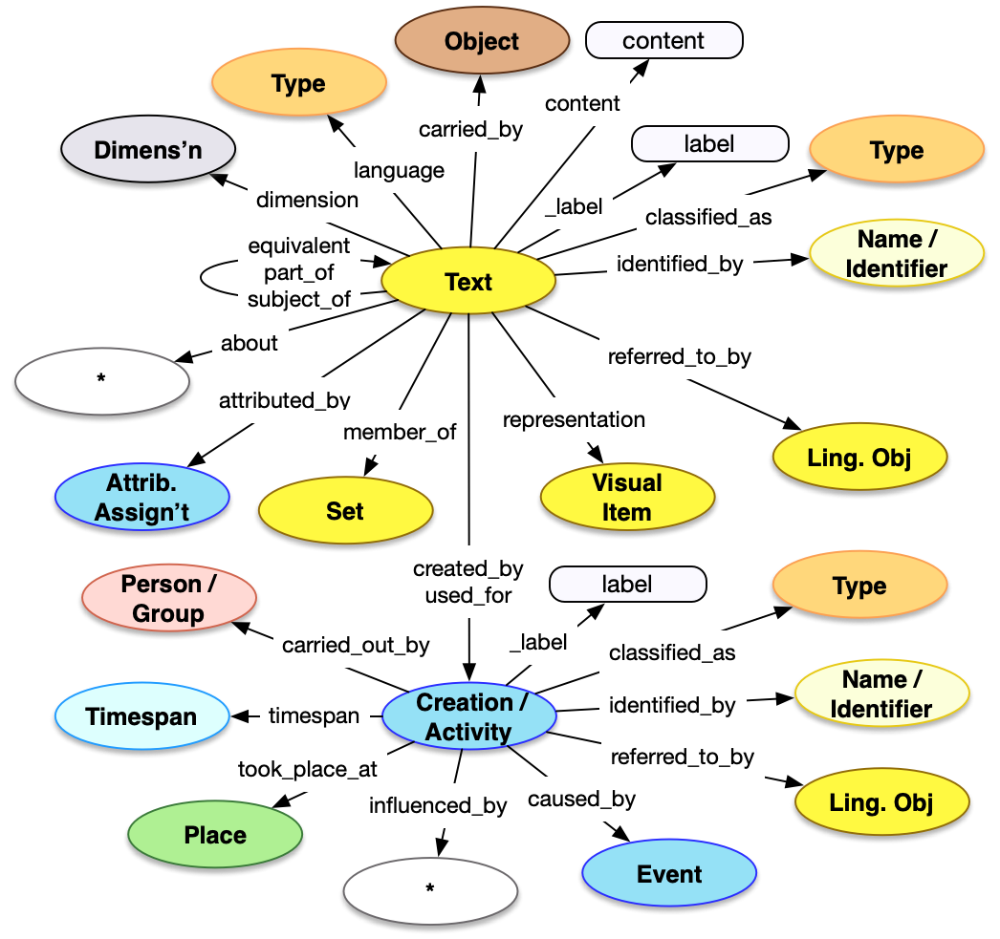

[TOC]

## Introduction

The Textual Work API is a method of getting access to descriptions of texts, such as the linguistic content carried in printed or digital books, linguistic content incorporated as part of artworks, or other noteworthy linguistic content.  The Textual Work model is of average complexity with many familiar properties and patterns, plus several additions to describe the text's relationship to other entities.  

For more information about the usage of Textual Work data, please see the [Document model](/model/document/) description.


## Property Definitions

Dereferencing an entity via the Textual Work endpoint would result in a JSON-LD document containing a single JSON object with the following properties.

### Properties of Textual Works

| Property Name     | Datatype      | Requirement | Description | 
|-------------------|---------------|-------------|-------------|
| `@context`        | string, array | Required    | The value MUST be the URI of the [Linked Art context](../../json-ld/) as a string, `"https://linked.art/ns/v1/linked-art.json"` or an array in which the URI is the last entry to allow for [extensions](../../json-ld/extensions) | 
| `id`              | string        | Required    | The value MUST be the HTTP(S) URI at which the text's representation can be [dereferenced](../../protocol/) |  
| `type`            | string        | Required    | The class for the text, which MUST be the value `"LinguisticObject"` |
| `_label`          | string        | Recommended | A human readable label for the text, intended for developers |
| `classified_as`   | array         | Recommended | An array of json objects, each of which is a classification of the text and MUST follow the requirements for [Type](../../shared/type/) |
| `identified_by`   | array         | Recommended | An array of json objects, each of which is a name/title of the text and MUST follow the requirements for [Name](../../shared/name/), or an identifier for the text and MUST follow the requirements for [Identifier](../../shared/identifier/) |
| `referred_to_by`  | array         | Optional    | An array of json objects, each of which is a human readable statement about the text and MUST follow the requirements for [Statement](../../shared/statement/) |
| `equivalent`      | array         | Optional    | An array of json objects, each of which is a [reference](../../shared/reference) to an external identity and description of the current text |
| `subject_of`      | array         | Optional    | An array of json objects, each of which is a reference to a Textual Work, the content of which is about the current work, and MUST follow the requirements for a [reference](../../shared/reference/) |
| `representation`  | array         | Optional    | An array of json objects, each of which is a reference to a [Visual Work](../visual_work) that represents the current text, and MUST follow the requirements for a [reference](../../shared/reference/) |
| `member_of`       | array         | Optional    | An array of json objects, each of which is a Set that the current text is a member of and MUST follow the requirements for a [reference](../../shared/reference/) to a Set |
| `attributed_by`   | array         | Optional    | An array of json objects, each of which is a [Relationship Assignment](../../shared/assignment/) that relates the current text to another entity |
| `language` | array | Optional | An array of json objects, each of which is a language the text is expressed in, and MUST follow the requirements for [Language](../../shared/type) |
| `dimension` | array | Optional | An array of json objects, each of which is a [Dimension](../../shared/dimension), such as total number of words, of the current text |
| `part_of` | array | Optional | An array of json objects, each of which is a [reference](../../shared/reference/) to another Textual Work or a [Visual Work](../visual_work/) that the current text is a part of. |
| `conceptually_part_of` | array | Optional | An array of json objects, each of which is a [reference](../../shared/reference/) to an [Abstract Work](../abstract_work/) that the current work is conceptually part of |
| `content` | string | Optional | The string representation of the textual content of the work |
| `format` | string | Optional | The media type of the encoding of the string representation given in the `content` property |
| `about` | array | Optional | An array of json objects, each of which is a [reference](../../shared/reference/) to another entity of any type, that this text is primarily about | 
| `subject_to` | array | Optional | An array of json objects, each of which is a [Right](../../shared/right) that is held over the intellectual work |
| `created_by` | json object | Optional | A json object representing the creation of the text, which follows the requirements for a [Creation](../../shared/activity) | 
| `used_for` | array | Optional | An array of json objects, each of which is a Publication Activity, which follows the requirements for an [Activity](../../shared/activity) |

### Property Diagram

> {:.diagram_img width="600px"}

### JSON Schema

See the [schema documentation](../../schema_docs/text) and the [schema itself](../../schema/text.json)


### Incoming Properties

Textual Work instances are typically found as the object of the following properties, other than the self-referential properties above.  This list is not exhaustive, but is intended to cover the likely cases where other endpoints refer to texts.

| Property Name              | Source Endpoint | Description |
|----------------------------|-----------------|-------------|
| `subject_of`               | All             | Any entity can be the subject of textual content |
| `carries`                  | [Physical Object](../physical_object/) | A physical object can carry a text, such as a manuscript and the text written on its pages |
| `digitally_carries`        | [Digital Object](../digital_object/)  | A digital object can also digitally carry a text, such as a word document and the text encoded in it |

## Example

The JSON for a Textual Work entry for a text of a book about Gainsborough's works could be as below.

* It has the Linked Art context document reference in `@context`
* It self-documents its URI in `id`
* It has a `type` of "LinguisticObject"
* It has a `_label` with the value "Gainsborough by Hayes" for people reading the JSON
* It is `classified_as` a "Monograph", which has an `id` of "aat:300060417"
* It is `identified_by` ...
    * ... a `Name`, with the content "Gainsborough: Paintings and Drawings"
    * ... an `Identifier` with the content "0714816396", which is `classified_as` an ISBN ("aat:300417443")
* It is `referred_to_by` a statement which ...
    * ... has `content` of "A thorough analysis of the artist's life and work"
    * ... is `classified_as` an Abstract ("aat:")
* It has a `language` of English ("aat:300388277")
* It is `about` Gainsborough, a Person with `id` "ulan:500115200"
* It was `created_by` a Creation which ...
    * ... was `carried_out_by` John Hayes, a Person
* It was `used_for` an Activity ...
    * ... which is `classified_as` Publishing ("aat:300054686")
    * ... `took_place_at` New York
    * ... and was `carried_out_by` Phaidon, a Group

```crom
top = vocab.MonographText(ident="auto int-per-segment", label="Gainsborough by Hayes")
top.identified_by = vocab.PrimaryName(content="Gainsborough: Paintings and Drawings")
top.identified_by = vocab.IsbnIdentifier(content="0714816396")
top.referred_to_by = vocab.Abstract(content="A thorough analysis of the artist's life and work")
top.language = vocab.instances['english']
top.about = model.Person(ident="http://vocab.getty.edu/ulan/500115200", label="Gainsborough, Thomas")
pub = vocab.Publishing()
pub.carried_out_by = model.Group(label="Phaidon")
pub.took_place_at = model.Place(label="New York")
ts = model.TimeSpan()
ts._label = "1975"
ts.begin_of_the_begin = "1975-01-01T00:00:00Z"
ts.end_of_the_end = "1975-12-31T23:59:59Z"
pub.timespan = ts
top.used_for = pub
cre = model.Creation()
cre.carried_out_by = model.Person(label="Hayes, John")
top.created_by = cre
```
