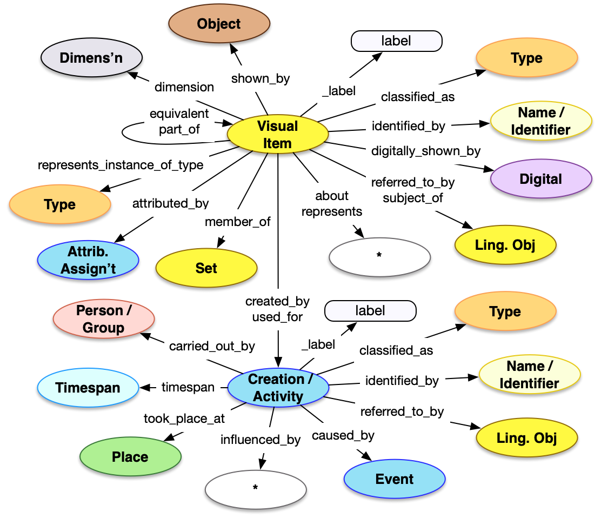

[TOC]

## Introduction

The Visual Work API is a method of getting access to descriptions of image content, such as the appearance of paintings and two-dimensional artworks, sculptures and three-dimensional artworks, or digital images.  The Visual Work model is of average complexity with many familiar properties and patterns, plus several additions to describe the visual work's relationship to other entities.  

For more information about the usage of Visual Work data, please see the [Object Aboutness model](/model/object/aboutness/) description.


## Property Definitions

Dereferencing an entity via the Visual Work endpoint would result in a JSON-LD document containing a single JSON object with the following properties.

### Properties of Visual Works

| Property Name     | Datatype      | Requirement | Description | 
|-------------------|---------------|-------------|-------------|
| `@context`        | string, array | Required    | The value MUST be the URI of the [Linked Art context](../../json-ld/) as a string, `"https://linked.art/ns/v1/linked-art.json"` or an array in which the URI is the last entry to allow for [extensions](../../json-ld/extensions) | 
| `id`              | string        | Required    | The value MUST be the HTTP(S) URI at which the visual work's representation can be [dereferenced](../../protocol/) |  
| `type`            | string        | Required    | The class for the visual work, which MUST be the value `"VisualItem"` |
| `_label`          | string        | Recommended | A human readable label for the visual work, intended for developers |
| `classified_as`   | array         | Recommended | An array of json objects, each of which is a classification of the visual work and MUST follow the requirements for [Type](../../shared/type/) |
| `identified_by`   | array         | Recommended | An array of json objects, each of which is a name/title of the visual work and MUST follow the requirements for [Name](../../shared/name/), or an identifier for the visual work and MUST follow the requirements for [Identifier](../../shared/identifier/) |
| `referred_to_by`  | array         | Optional    | An array of json objects, each of which is a human readable statement about the visual work and MUST follow the requirements for [Statement](../../shared/statement/) |
| `equivalent`      | array         | Optional    | An array of json objects, each of which is a [reference](../../shared/reference) to an external identity and description of the current visual work |
| `member_of`       | array         | Optional    | An array of json objects, each of which is a Set that the current visual work is a member of and MUST follow the requirements for a [reference](../../shared/reference/) to a Set |
| `subject_of`      | array         | Optional    | An array of json objects, each of which is a reference to a [Textual Work](../textual_work/), the content of which focuses on the current visual work, and MUST follow the requirements for a [reference](../../shared/reference/) |
| `attributed_by`   | array         | Optional    | An array of json objects, each of which is a [Relationship Assignment](../../shared/assignment/) that relates the current visual work to another entity |
| `dimension` | array | Optional | An array of json objects, each of which is a [Dimension](../../shared/dimension), such as abstract height or width, of the current visual work |
| `part_of` | array | Optional | An array of json objects, each of which is a [reference](../../shared/reference/) to another Visual Work or a [Textual Work](../textual_work/) that the current visual work is a part of |
| `about` | array | Optional | An array of json objects, each of which is a [reference](../../shared/reference/) to another entity of any type, that this text is primarily about | 
| `represents` | array | Optional | An array of json objects, each of which is a [reference](../../shared/reference/) to another entity of any type, that this visual work represents or depicts |
| `represents_instance_of_type` | array | Optional | An array of json objects, each of which is a type of another entity that this visual work represents or depicts, but where the individual is not known and MUST follow the requirements for [Type](../../shared/type/) |
| `subject_to` | array | Optional | An array of json objects, each of which is a [Right](../../shared/right) that is held over the intellectual work |
| `created_by` | json object | Optional | A json object representing the creation of the image, which follows the requirements for a [Creation](../../shared/activity) | 
| `used_for` | array | Optional | An array of json objects, each of which is a Publication Activity, which follows the requirements for an [Activity](../../shared/activity) |

### Property Diagram

> {:.diagram_img width="600px"}

### JSON Schema

See the [schema documentation](../../schema_docs/image) and the [schema itself](../../schema/image.json)


### Incoming Properties

Visual Work instances are typically found as the object of the following properties, other than the self-referential properties above.  This list is not exhaustive, but is intended to cover the likely cases where other endpoints refer to image content.

| Property Name              | Source Endpoint | Description |
|----------------------------|-----------------|-------------|
| `representation`           | All             | Entities can be represented in visual content, in other words the content of an image that depicts them. |
| `shows`                    | [Physical Object](../physical_object/) | A physical object can show visual content |
| `digitally_shows`          | [Digital Object](../digital_object/) | A digital object, similarly, can digitally show visual content | 


## Example

The JSON for a Visual Work entry for a visual content of Miro's "The Farm" could be as below.

* It has the Linked Art context document reference in `@context`
* It self-documents its URI in `id`
* It has a `type` of "VisualItem"
* It has a `_label` with the value "Appearance of Miro's The Farm" for people reading the JSON
* It is `classified_as` "Cubist", which has an `id` of "aat:300021495", which is in turn `classified_as` being a Style ("aat:300015646")
* It is `identified_by` a `Name`, with the content "Appearance of The Farm"
* It is `referred_to_by` a statement which ...
    * ... has `content` of "A brilliant amalgamation of an intense ..."
    * ... is `classified_as` a Description ("aat:300435416")
* It `represents` a Place, Mont-roig del Camp
* It `represents_instance_of_type` Tree ("aat:300132410"), meaning there is a tree depicted but the tree has no separate identity beyond the content
* It was `created_by` a Creation which ...
    * ... was `carried_out_by` Miro
    * ... had a `timespan` of between "1921-01-01" and "1922-12-31"

```crom
top = model.VisualItem(ident="auto int-per-segment", label="Appearance of Miro's The Farm")
n = model.Name(content="Appearance of The Farm")
top.identified_by = n
c = model.Type(ident="http://vocab.getty.edu/aat/300021495", label="Cubist")
c.classified_as = model.Type(ident="http://vocab.getty.edu/aat/300015646", label="Style")
top.classified_as = c
top.referred_to_by = vocab.Description(content="A brilliant amalgamation of an intense, even primitive, realism with the formal vocabulary of cubism.")
top.represents = model.Place(ident="http://vocab.getty.edu/tgn/7300934", label="Mont-roig del Camp")
top.represents_instance_of_type = model.Type(ident="http://vocab.getty.edu/aat/300132410", label="Tree")
top.shown_by = model.HumanMadeObject(ident="https://www.nga.gov/collection/art-object-69660", label="The Farm")
cre = model.Creation()
cre.carried_out_by = model.Person(ident="http://vocab.getty.edu/ulan/500014094", label="Miro")
ts = model.TimeSpan(label="1921-1922")
ts.begin_of_the_begin = "1921-01-01T00:00:00Z"
ts.end_of_the_end = "1922-12-31T23:59:59Z"
cre.timespan = ts
top.created_by = cre
```
