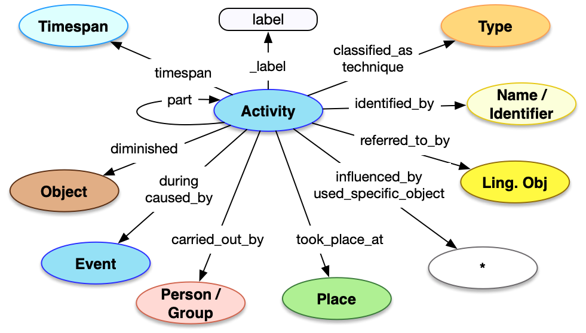

## Introduction

Although the data model is activity-centric, it is often more efficient to embed the descriptions of activities within the description of the entity that the activity created, destroyed or used. This pattern is used for bringing things into existence (Productions, Creations, Formations), taking things out of existence (Destruction, Dissolution, Death) and activities that are carried out by people such as their professional activities.


## Property Definitions

The activity data structure has the following properties.

### Properties of Activities

| Property Name     | Datatype      | Requirement | Description | 
|-------------------|---------------|-------------|-------------| 
| `id`              | string        | Optional    | If present, the value MUST be a URI identifying the activity, from which a representation of the activity can be retrieved |  
| `type`            | string        | Required    | The class for the activity, the value for which MUST be taken from the table below |
| `_label`          | string        | Recommended | Non-Semantic. A human readable label for the activity, intended for developers |
| `_complete`       | boolean       | Optional    | Non-Semantic. If there is an `id` property with a URI, and there is more information about the activity available from the representation at that URI, then `_complete` MUST be present with a value of `false` to inform the consuming application that it might want to retrieve it |
| `identified_by`   | array         | Recommended | An array of json objects, each of which is a name of the activity and MUST follow the requirements for [Name](../../shared/name/), or an identifier for the activity and MUST follow the requirements for [Identifier](../../shared/identifier/)|
| `classified_as`   | array         | Recommended | An array of json objects, each of which is a further classification of the activity and MUST follow the requirements for [Type](../type/) |
| `referred_to_by`  | array         | Optional    | An array of json objects, each of which is an embedded [statement](../statement/) about the activity |
| `took_place_at`   | array         | Optional    | An array of json objects, each of which is a [reference](../../shared/reference/) to a [Place](../place/) where the activity occured |
| `timespan`        | json object   | Optional    | A json object which describes when the activity occured, and MUST follow the requirements for [timespans](../timespan/)|
| `during`          | array         | Optional    | An array of json objects, each of which is a [reference](../../shared/reference) to a [Period](../event/) during which the activity occured |
| `before`          | array         | Optional    | An array of json objects, each of which is a [reference](../../shared/reference) to a Period, Event or Activity before which this event occured |
| `after`          | array         | Optional    | An array of json objects, each of which is a [reference](../../shared/reference) to a Period, Event or Activity after which this event occured |
| `caused_by`       | array         | Optional    | An array of json objects, each of which is a [reference](../../shared/reference/) to an [Event](../event/) that caused this event to occur |
| `carried_out_by`  | array         | Optional    | An array of json objects, each of which is a [reference](../reference/) to a [Person](../../endpoint/person) or [Group](../../endpoint/group) which carried out the activity. **NOT usable when the `type` is `"Birth"` or `"Death"`**|
| `influenced_by`   | array         | Optional    | An array of json objects, each of which is a [reference](../../shared/reference/) to an entity that influenced or motivated the activity in some noticable fashion. **NOT usable when the `type` is `"Birth"` or `"Death"`** | 
| `used_specific_object` | array    | Optional    | An array of json objects, each of which is a [reference](../../reference/) to an entity that was instrumental in the carrying out of this activity. **NOT usable when the `type` is `"Birth"` or `"Death"`** |
| `technique` | array | Optional | An array of json objects, each of which is a technique used in the activity and MUST follow the requirements for [Type](../../shared/type). **NOT usable when the `type` is `"Birth"` or `"Death"`** |
| `part` | array | Optional | An array of json objects, each of which is another instance of this same event type. **NOT usable when the `type` is `"Birth"` or `"Death"`** | 
| `diminished` | json object | Optional | A json objects which is a [reference](../../shared/reference/) to another Physical Object that this object was removed from by this event. **Only usable when the `type` is `"PartRemoval"`**|

### Activity Classes Available

| Endpoint / Pattern| Beginning     | Ending      | Other       | 
|-------------------|---------------|-------------|-------------| 
| Abstract Work     | Creation      | -           | -           |
| Concept           | Creation      | -           | -           |
| Digital Object    | Creation      | -           | Activity    |
| Group             | Formation     | Dissolution | Activity    |
| Person            | Birth         | Death       | Activity    |
| Physical Object   | Production, PartRemoval | Destruction | Encounter, Modification, Activity | 
| Set               | Creation      | -           | Activity    |
| Textual Work      | Creation      | -           | Activity    |
| Visual Work       | Creation      | -           | Activity    |
| Statement         | Creation      | -           | -           |      


### Property Diagram

> {:.diagram_img width="600px"}

### Incoming Properties

Activity instances are typically found as the object of the following properties.

| Property Name    | Class        | Description |
|------------------|--------------|-------------|
| `created_by`     | Creation     | The beginning of a conceptual or digital thing |
| `formed_by`      | Formation    | The beginning of a group |
| `dissolved_by`   | Dissolution  | The end of a group |
| `born`           | Birth        | The beginning of a person |
| `died`           | Death        | The end of a person |
| `produced_by`    | Production   | The beginning of a physical thing |
| `removed_by`     | PartRemoval  | The beginning of a physical thing, when it is removed from something else |
| `modified_by`    | Modification | The modification of a physical thing |
| `destroyed_by`   | Destruction  | The ending of a physical thing |
| `encountered_by` | Encounter    | The discovery or interaction with a physical thing |
| `used_for`       | Activity     | The use of a thing for some activity, typically publication |
| `participated_in`| Activity     | An activity that a Person or Group participated in |
| `carried_out`    | Activity     | An activity that a Person or Group carried out directly |


## Example

The [Mona Lisa](../../endpoint/physical_thing/):

  * ... was produced by Leonardo da Vinci
  * ... between 1503 and 1506
  * ... in Florence
  * ... using the painting technique
  * ... the production was influenced by Lisa del Giocondo


```crom
top = vocab.Painting(ident="auto int-per-segment", label="Mona Lisa")
prod = model.Production()
prod.carried_out_by = model.Person(ident="http://vocab.getty.edu/ulan/500010879", label="Leonardo da Vinci")
ts = model.TimeSpan()
ts.begin_of_the_begin = "1503-01-01T00:00:00Z"
ts.end_of_the_end = "1506-12-31T23:59:59Z"
ts.identified_by = vocab.DisplayName(content="1503-1506")
prod.timespan = ts
prod.took_place_at = model.Place(ident="http://vocab.getty.edu/tgn/7000457", label="Florence, Italy")
prod.technique = model.Type(ident="http://vocab.getty.edu/aat/300054216", label="Painting Technique")
prod.influenced_by = model.Person(ident="http://vocab.getty.edu/ulan/500341678", label="Lisa del Giocondo")
top.produced_by = prod
```

