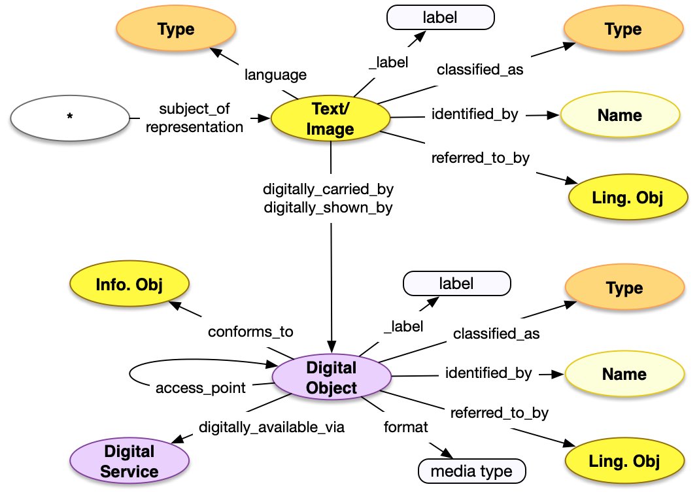

<style>
th, td {
  padding: 5px 5px;
  text-align: left;
  border: 1px solid #D0D0D0; }
th { background: #F0F0F0; }
th:first-child, td:first-child { padding-left: 3px; }
th:last-child, td:last-child { padding-right: 3px; }
</style>

[TOC]

## Introduction

There are many references to external digital resources that are necessary to include in a description of a core entity, including images of the entity or a web page about the entity. These references can be managed with separate records describing the various textual works, visual works and digital objects, however it is much easier and more usable to embed the information necessary within the record that the work depicts or describes. As such, this is a specific embedding case of the general pattern that can still be used when there is more information about the resources involved.

This is a complex shared structure in that it involves nested JSON objects rather than a single level. The first level is an embedded Textual or Visual Work, which then refers to an embedded Digital Object.


## Property Definitions

### Properties of Embedded Works

| Property Name     | Datatype      | Requirement | Description | 
|-------------------|---------------|-------------|-------------|
| `id`              | string        | Optional    | If present, the value MUST be a URI identifying the work, from which a representation of it can be retrieved | 
| `type`            | string        | Required    | The class for the work, which MUST be the value `"VisualItem"` or `"LinguisticObject"`| 
| `_label`          | string        | Optional    | A human readable label, intended for developers |
| `_complete`       | boolean       | Optional    | Non-Semantic. If there is an `id` property with a URI, and there is more information about the work available from the representation at that URI, then `_complete` MUST be present with a value of `false` to inform the consuming application that it might want to retrieve it |
| `classified_as`   | array         | Optional | An array of json objects, each of which is a further classification of the work and MUST follow the requirements for [Type](../type/) |
| `identified_by`   | array         | Optional    | An array of json objects, each of which is a name for the work and follows the [Name](../name/) pattern |
| `referred_to_by`  | array         | Optional    | An array of json objects, each of which is an embedded [statement](../statement/) about the work |
| `digitally_shown_by` | array | Required * | Used only when `type` is `"VisualItem"`. An array of json objects, each of which is a DigitalObject as described below |
| `digitally_carried_by` | array | Required * | Used only when `type` is `"LinguisticObject"`. An array of json objects, each of which is a DigitalObject as described below |
| `language` | array | Optional | Used only when `type` is `"LinguisticObject"`. An array of json objects, each of which is a language the text is expressed in, and MUST follow the requirements for [Language](../../shared/type) |

* \* Note Well that exactly one of `digitally_shown_by` and `digitally_carried_by`, as appropriate for the class of the Work, MUST be present


### Properties of Embedded Digital Objects

| Property Name     | Datatype      | Requirement | Description | 
|-------------------|---------------|-------------|-------------|
| `id`              | string        | Optional    | If present, the value MUST be a URI identifying the digital object, from which a representation of it can be retrieved | 
| `type`            | string        | Required    | The class for the work, which MUST be the value `"DigitalObject"` | 
| `_label`          | string        | Optional    | A human readable label, intended for developers |
| `_complete`       | boolean       | Optional    | Non-Semantic. If there is an `id` property with a URI, and there is more information about the digital object available from the representation at that URI, then `_complete` MUST be present with a value of `false` to inform the consuming application that it might want to retrieve it |
| `classified_as`   | array         | Optional | An array of json objects, each of which is a further classification of the digital object and MUST follow the requirements for [Type](../type/) |
| `identified_by`   | array         | Optional    | An array of json objects, each of which is a name for the digital object and follows the [Name](../name/) pattern |
| `referred_to_by`  | array         | Optional    | An array of json objects, each of which is an embedded [statement](../statement/) about the digital object |
| `access_point` | array | Optional | An array of json objects, each of which has only two properties: `id` which contains the URI where the representation of the described digital object can be retrieved, and `type` which has the value `"DigitalObject"`. Both are required |
| `digitally_available_via` | array | Optional| An array of json objects, each of which is a Digital Service structure, defined in the [Digital Object](../../endpoint/digital_object) documentation |
| `format` | string | Optional | The media type of the described digital object, for example "image/jpeg" |
| `conforms_to` | array | Optional | An array of json objects, each of which is a [reference](../../shared/reference/) to an external specification that the current digital object conforms to. The `type` value of the reference MUST be `"InformationObject"` |


### Property Diagram

> {:.diagram_img width="600px"}


### Incoming Properties

Name instances are typically found as the object of the following properties.  This list is not exhaustive, but is intended to cover the likely cases.

| Property Name   | Source Class     | Description |
|-----------------|------------------|-------------|
| `representation`| All              | When the Work is a Visual Item. |
| `subject_of`    | All              | When the Work is a Linguistic Object. |


## Example

An object has a home page at https://example.org/objects/1 which carries text in English.


```crom
top = model.HumanMadeObject(ident="auto int-per-segment")
top.identified_by = vocab.PrimaryName(content="Object")
lo = model.LinguisticObject()
lo.language = vocab.instances['english']
wp = vocab.WebPage()
lo.digitally_carried_by = wp
wp.access_point = model.DigitalObject(ident="https://example.org/objects/1")
wp.identified_by = vocab.PrimaryName(content="Home page for Object")
top.subject_of = lo
```


