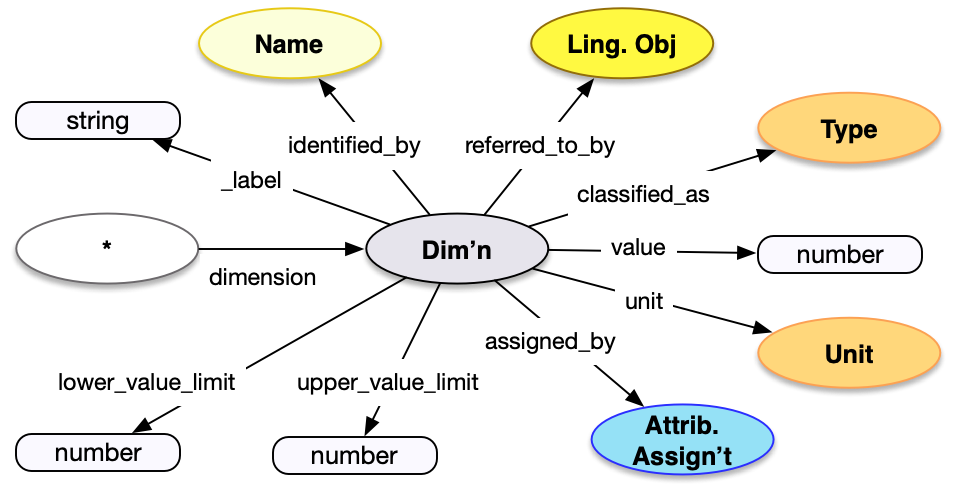

<style>
th, td {
  padding: 5px 5px;
  text-align: left;
  border: 1px solid #D0D0D0; }
th { background: #F0F0F0; }
th:first-child, td:first-child { padding-left: 3px; }
th:last-child, td:last-child { padding-right: 3px; }
</style>

[TOC]

## Introduction

Dimensions are a combination of a numeric value, a unit for the value, and a classification as to what sort of value it is. They can be measured on the entity by some means, such as counting or using an instrument. The data structure is commonly used for physical things (e.g. height and width), but is also applicable to textual works (e.g. number of words) or even people (e.g. height, weight). If there is a countable feature, then that can be expressed as a dimension using this data structure. 

## Property Definitions

The dimension data structure has the following properties.

### Properties of Dimensions

| Property Name     | Datatype      | Requirement | Description | 
|-------------------|---------------|-------------|-------------|
| `id`              | string        | Optional    | If present, the value MUST be a URI identifying the dimension |  
| `type`            | string        | Required    | The class for the name, which MUST be the value `"Dimension"` |
| `_label`          | string        | Recommended | A human readable label, intended for developers |
| `value`           | number        | Required    | The numeric value of the dimension |
| `unit`            | json object   | Required    | The unit for the dimension, which MUST follow the requirements for a [MeasurementUnit](../type/) |
| `classified_as`   | array         | Recommended | An array of json objects, each of which is a further classification of the dimension and MUST follow the requirements for [Type](../type/) |
| `identified_by`   | array         | Recommended | An array of json objects, each of which is a textual representation of the structured data in the dimension, and MUST follow the requirements for [Name](../name/) |
| `upper_value_limit` | number      | Optional    | A number, which represents the highest possible value for the dimension|
| `lower_value_limit` | number      | Optional    | A number, which represents the lowest possible value for the dimension |
| `referred_to_by`  | array         | Optional    | An array of json objects, each of which is either a [reference](../reference/) to a [textual work](../../endpoint/textual_work/) that refers to the dimension, or an embedded [statement](../statement/) about the dimension. |
| `assigned_by`     | array         | Optional    | An array of json objects, each of which is a measurement activity for the dimension, as below |  

### Properties of Measurements

| Property Name     | Datatype      | Requirement | Description | 
|-------------------|---------------|-------------|-------------|
| `id`              | string        | Optional    | If present, the value MUST be a URI identifying the measurement |  
| `type`            | string        | Required    | The class for the name, which MUST be the value `"AttributeAssignment"` |
| `_label`          | string        | Recommended | A human readable label for the assignment, intended for developers |
| `classified_as`   | array         | Recommended | An array of json objects, each of which is a further classification of the measurement and MUST follow the requirements for [Type](../type/) |
| `carried_out_by`  | array         | Recommended | An array of json objects, each of which is a [reference](../reference/) to a [Person](../../endpoint/person) or [Group](../../endpoint/group) |
| `timespan`        | json object   | Optional    | A json object which MUST follow the requirements for [timespans](../timespan/)|
| `referred_to_by`  | array         | Optional    | An array of json objects, each of which is an embedded [statement](../statement/) about the measurement |

### Property Diagram

> {:.diagram_img width="600px"}

### Incoming Properties

Dimension instances are typically found as the object of the following properties.  This list is not exhaustive, but is intended to cover the likely cases.

| Property Name   | Source Endpoint   | Description |
|-----------------|-------------------|-------------|
| `dimension`     | [Physical Object](../../endpoint/physical_object/), [Digital Object](../../endpoint/digital_object), and others | The dimension instance is a dimension of the source entity, especially for physical and digital objects |
| `duration`      | TimeSpan in All   | The dimension is the length of time (duration) of the actual time span, within the boundaries described in the TimeSpan instance, which can be present in all endpoints |

## Example

A Human-Made Object [instance](../../endpoint/physical_thing/) has a dimension of 24 (+/- 2) inches high, as measured by a curator:

* The dimension has a URI given as an identifier in `id`
* It has a `type` of "Dimension"
* It is `classified_as` a height, with `id` of _aat:300055644_, and a `type` of `Type`
* It has a `value` of 24, an `upper_value_limit` of 26, and a `lower_value_limit` of 22, for 24 plus or minus 2.
* It has a `unit` of inches, with `id` of _aat:300379100_ and a `type` of `MeasurementUnit`
* It is `identified_by` a Name, which is `classified_as` a display title, with an `id` of _aat:300404669_ and `type` of Type.  The Name has `content` of the string "24 inches high (+/- 2 inches)"
* It is `assigned_by` a measurement, which...
  * ... has a URI given in `id`
  * ... has a `type` of `AttributeAssignment`
  * ... is `classified_as` measuring, with `id` of _aat:300053578_ and a `type` of Type
  * ... is `carried_out_by` the curator, being a [reference](../reference/) to an instance in a [person endpoint](../../endpoint/person/)

```crom
top = model.HumanMadeObject()
d = vocab.Height()
d.value = 24
d.unit = vocab.instances['inches']
d.lower_value_limit = 22
d.upper_value_limit = 26
aa = vocab.Measuring()
aa.carried_out_by = model.Person(label="Curator")
d.assigned_by = aa
d.identified_by =  vocab.DisplayName(content="24 inches high (+/- 2 inches)")
top.dimension = d
```
