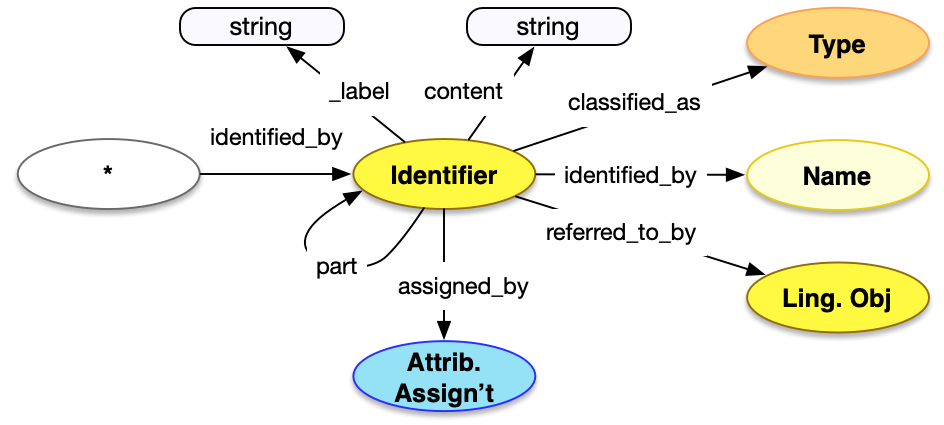

<style>
th, td {
  padding: 5px 5px;
  text-align: left;
  border: 1px solid #D0D0D0; }
th { background: #F0F0F0; }
th:first-child, td:first-child { padding-left: 3px; }
th:last-child, td:last-child { padding-right: 3px; }
</style>

[TOC]

## Introduction

Identifiers are codes in string form assigned to some resource to identify it within a particular context. All of the different types of entity can have identifiers assigned to them.  Identifiers are very similar in structure to [Names](../name/), but are explicitly not part of natural langauge, and hence do not have a `language` property, nor can they be translated or have alternative forms and hence are documented separately.

Identifiers are described in the [base patterns](/model/base/#types-and-classifications) of the model documentation, and examples are present for practically every class.

## Property Definitions

Identifiers have the following properties.

### Properties of Identifiers

| Property Name     | Datatype      | Requirement | Description | 
|-------------------|---------------|-------------|-------------|
| `id`              | string        | Optional    | If present, the value MUST be a URI identifying the identifier, rather than the URI which is the identifier of the object |  
| `type`            | string        | Required    | The class for the name, which MUST be the value `"Identifier"` |
| `_label`          | string        | Recommended | A human readable label, intended for developers |
| `content`         | string        | Required    | The string content of the identifier |
| `classified_as`   | array         | Recommended | An array of json objects, each of which is a further classification of the identifier and MUST follow the requirements for [Type](../type/) |
| `referred_to_by`  | array         | Optional    | An array of json objects, each of which is either a [reference](../reference/) to a [textual work](../../endpoint/textual_work/) that refers to the identifier, or an embedded [statement](../statement/) about the identifier. |
| `assigned_by`     | array         | Optional    | An array of json objects, each of which is an assignment of the identifier, as below |  


### Properties of Identifier Assignments

| Property Name     | Datatype      | Requirement | Description | 
|-------------------|---------------|-------------|-------------|
| `id`              | string        | Optional    | If present, the value MUST be a URI identifying the assignment |  
| `type`            | string        | Required    | The class for the name, which MUST be the value `"AttributeAssignment"` |
| `_label`          | string        | Recommended | A human readable label for the assignment, intended for developers |
| `classified_as`   | array         | Recommended | An array of json objects, each of which is a further classification of the assignment and MUST follow the requirements for [Type](../type/) |
| `carried_out_by`  | array         | Recommended | An array of json objects, each of which is a [reference](../reference/) to a [Person](../../endpoint/person) or [Group](../../endpoint/group) |
| `timespan`        | json object   | Optional    | A json object which MUST follow the requirements for [timespans](../timespan/)|
| `referred_to_by`  | array         | Optional    | An array of json objects, each of which is an embedded [statement](../statement/) about the assignment |
| `used_specific_object` | array    | Optional    | An array of json objects, each of which is a [reference](../reference/) to another endpoint that was instrumental in the assignment of the identifier |


### Property Diagram

> {:.diagram_img width="600px"}


### Incoming Properties

Identifier instances are typically found as the object of the following properties.  This list is not exhaustive, but is intended to cover the likely cases.

| Property Name   | Source Endpoint   | Description |
|-----------------|-------------------|-------------|
| `identified_by` | All               | The most common case is for a resource to be identified_by an Identifier, which can be found in every endpoint |
| `contact_point` | [Person](../../endpoint/person/), [Group](../../endpoint/group/) | People and Groups can also have contact points, which are modeled as Identifiers. |

## Example

An accession number for an object, created and assigned by Example Museum at some point during 1997.

* It has a URI given in `id` (which identifies the Identifier, not the Object)
* It has a `type` of "Identifier"
* It has a human readable `_label` of "Example Museum Accession Number" to explain what it is
* It is `classified_as` an accession number, with an `id` of _aat:300312355_ and a `type` of Type
* It is `referred_to_by` a statement, with a `type` of "LinguisticObject" and `content` of "This is the original...". The LinguisticObject is `classified_as` a note, with an `id` of _aat:300418049_ and `type` of Type
* It has `content` of the value "1997-A1752"
* It was `assigned_by` an identifier assignment, which ...
  * ... has a URI given in `id` (which identifies the assignment)
  * ... has a `type` of "AttributeAssignment"
  * ... has a `timespan` structure, with a `begin_of_the_begin` date of Jan 1 1997 and an `end_of_the_end` date of Dec 31 1997
  * ... was `carried_out_by` a [reference](../reference/) to the organization that created the identifer, with a `type` of "Group"

```crom
top = model.HumanMadeObject()
id = vocab.AccessionNumber(label="Example Museum Accession Number", content="1997-A1752")
top.identified_by = id
id.referred_to_by = vocab.Note(content="This is the original accession number from 1997")
aa = model.AttributeAssignment(label="Assignment of 1997-A1752")
id.assigned_by = aa
aa.carried_out_by = model.Group(label="Example Museum")
ts = model.TimeSpan(label="1997")
aa.timespan = ts
ts.begin_of_the_begin = "1997-01-01T00:00:00Z"
ts.end_of_the_end = "1997-12-31T00:00:00Z"
```
