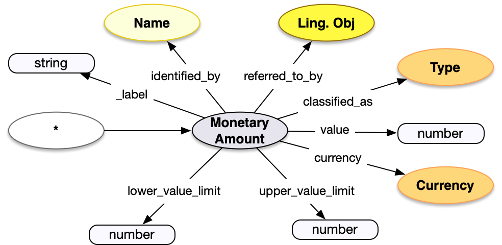

<style>
th, td {
  padding: 5px 5px;
  text-align: left;
  border: 1px solid #D0D0D0; }
th { background: #F0F0F0; }
th:first-child, td:first-child { padding-left: 3px; }
th:last-child, td:last-child { padding-right: 3px; }
</style>

[TOC]

## Introduction

Monetary Amounts are similar to [Dimensions](../dimension/) in that they are primarily a `value` with a unit to clarify what the number refers to, but in this case the unit is a `currency`.  The amount is a particular instance of a value/currency combination, so there can be multiple amounts each of which have the same value and currency, but are used in different models.  This is the same as the way there can be multiple dimensions with the same classification, value and unit used in different models.

In the Linked Art API and model, amounts are only used in the [Provenance Activity](../../endpoint/provenance_activity/) structure, as described in the [Provenance](/model/provenance/) model documentation.

## Property Definitions

The monetary amount data structure has the following properties.

### Properties of Monetary Amounts

| Property Name     | Datatype      | Requirement | Description | 
|-------------------|---------------|-------------|-------------|
| `id`              | string        | Optional    | If present, the value MUST be a URI identifying the monetary amount |  
| `type`            | string        | Required    | The class for the name, which MUST be the value `"MonetaryAmount"` |
| `_label`          | string        | Recommended | A human readable label, intended for developers |
| `value`           | number        | Required    | The numeric value of the amount |
| `currency`        | json object   | Required    | The currency for the amount, which MUST follow the requirements for a [Currency](../type/) |
| `classified_as`   | array         | Recommended | An array of json objects, each of which is a further classification of the amount and MUST follow the requirements for [Type](../type/) |
| `identified_by`   | array         | Recommended | An array of json objects, each of which is a textual representation of the structured data in the amount, and MUST follow the requirements for [Name](../name/) |
| `upper_value_limit` | number      | Optional    | A number, which represents the highest possible value for the amount|
| `lower_value_limit` | number      | Optional    | A number, which represents the lowest possible value for the amount |
| `referred_to_by`  | array         | Optional    | An array of json objects, each of which is either a [reference](../reference/) to a [textual work](../../endpoint/textual_work/) that refers to the amount, or an embedded [statement](../statement/) about the amount. |

### Property Diagram

> {:.diagram_img width="600px"}

### Incoming Properties

Dimension instances are typically found as the object of the following properties.  This list is not exhaustive, but is intended to cover the likely cases.

| Property Name   | Source Endpoint   | Description |
|-----------------|-------------------|-------------|
| `paid_amount`   | [Provenance Activity](../../endpoint/provenance_activity/) | Monetary amounts are mostly used to record the amount of money that changes hands in a transaction, referred to from a Payment in a Provenance Activity | 
| `dimension`     | [Set](../../endpoint/set/)      | Monetary amounts can be associated with other entities, such as a Set of objects, with the dimension property  |


## Example

An auction lot has a monetary amount which ...

* ... has a `type` of "MonetaryAmount"
* ... is `classified_as` a starting price, with an `id` of _aat:300417242_ and a `type` of "Type"
* ... has a `value` of 500
* ... and a `currency` of US dollars, with an `id` of _aat:300411994_ and a `type` of "Currency"
* ... has a display label with the content of "500 US Dollars"
* ... and is `referred_to_by` a note, with the content "From personal correspondence"


```crom
top = model.Set(label = "Set of Objects for Lot 812")
amnt = vocab.StartingPrice(label="$500", value=500)
amnt.currency = vocab.instances['us dollars']
amnt.identified_by = vocab.DisplayName(content="500 US Dollars")
amnt.referred_to_by = vocab.Note(content="From personal correspondence")
top.dimension = amnt
```
