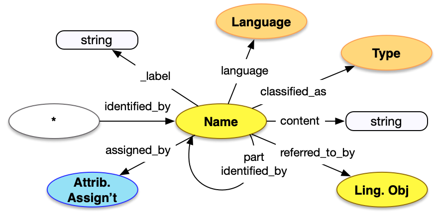

<style>
th, td {
  padding: 5px 5px;
  text-align: left;
  border: 1px solid #D0D0D0; }
th { background: #F0F0F0; }
th:first-child, td:first-child { padding-left: 3px; }
th:last-child, td:last-child { padding-right: 3px; }
</style>

[TOC]

## Introduction

Names are linguistic labels given to some entity, and represented as a common JSON structure in all endpoints. 

Names are described in the [base patterns](/model/base/#types-and-classifications) of the model documentation, and examples are present for practically every class.

## Property Definitions

### Properties of Names

| Property Name     | Datatype      | Requirement | Description | 
|-------------------|---------------|-------------|-------------|
| `id`              | string        | Optional    | If present, the value MUST be a URI identifying the name |  
| `type`            | string        | Required    | The class for the name, which MUST be the value `"Name"` |
| `_label`          | string        | Optional    | A human readable labe, intended for developers |
| `content`         | string        | Required    | The string form of the Name |
| `classified_as`   | array         | Recommended | An array of json objects, each of which is a further classification of the name and MUST follow the requirements for [Type](../type/) |
| `language`        | array         | Recommended | An array of json objects, each of which is a language present in the content of the name and MUST follow the requirements for [Language](../type/)|
| `part`            | array         | Optional    | An array of json objects, each of which is a part of the current name, and MUST follow these requirements for Names| 
| `referred_to_by`  | array         | Optional    | An array of json objects, each of which is either a reference to a [textual work](../../endpoint/textual_work/) that refers to the name, or an embedded [statement](../statement/) about the name. | 

### Property Diagram

> {:.diagram_img width="600px"}


### Incoming Properties

Name instances are typically found as the object of the following properties.  This list is not exhaustive, but is intended to cover the likely cases.

| Property Name   | Source Class      | Description |
|-----------------|-------------------|-------------|
| `identified_by` | All               | Names are used to provide an identifying label to the entity via identified_by. |

(And that's all!)

## Example

An object is given the name "Hacha (Ceremonial Axe)", with a note that the original form was 'hacha'.

* It has a URI given in `id` (that identifies the Name itself, not the object)
* It has a `type` of "Name"
* It is `classified_as` a primary name, with `id` of _aat:300404670_ and a `type` of "Type"
* It has `content` of "Hacha (Ceremonial Axe)"
* It is `referred_to_by` a statement, with a `type` of "LinguisticObject", `classified_as` a note with `id` of _aat:300027200_ and with `content` of "Title was originally ..."
* It has languages of English, with an `id` of _aat:300388277_ and `type` of "Language", and Spanish, with an `id` of _aat:300389311_ and `type` of "Language"
* It has a specific `part`, which ...
  * ... also has a `type` of "Name"
  * ... is `classified_as` a subtitle, with an `id` of _aat:300312006_
  * ... has `content` of "Ceremonial Axe"
  * ... and a language of English, as above. 

```crom
top = model.HumanMadeObject()
n = vocab.PrimaryName(content="Hacha (Ceremonial Axe)")
n.language = instances['spanish']
n.language = instances['english']
top.identified_by = n
st = vocab.Subtitle(content="Ceremonial Axe")
st.language = vocab.instances['english']
n.part = st
n.referred_to_by = vocab.Note(content="Title was originally given as 'hacha'")
```


## Future Considerations

* Explicit pairs of alternative names or translations of names. For example the name "Axe" is a translation of "Hacha", or "Æon Flux" has an alternative transliteration of "AEon Flux".
* Assignments, as described for [Identifiers](../identifier/), could easily be added for Names, but there has not been a use case proposed.

