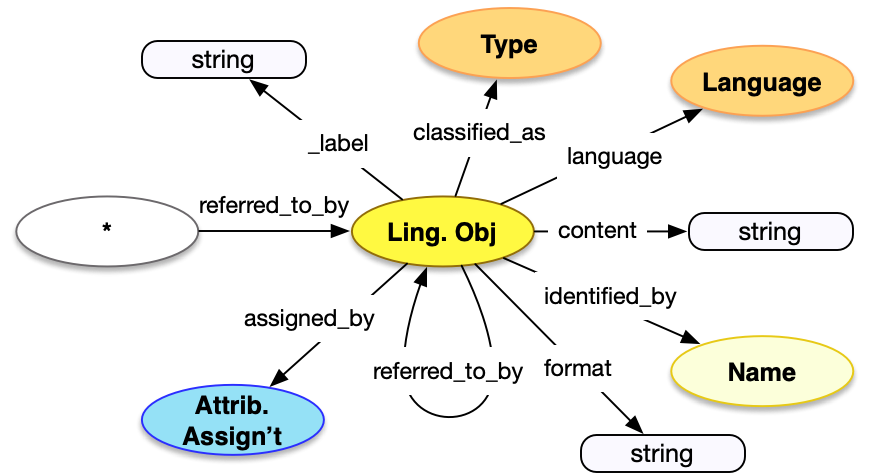

<style>
th, td {
  padding: 5px 5px;
  text-align: left;
  border: 1px solid #D0D0D0; }
th { background: #F0F0F0; }
th:first-child, td:first-child { padding-left: 3px; }
th:last-child, td:last-child { padding-right: 3px; }
</style>

[TOC]

## Introduction

Statements are a human-readable expression of the content or note about the entity being referred to. Even if there are structured forms of the resources, these textual descriptions are useful to render to end users. They can have both internationalized `content`, as well as internationalized labels in the form of `Name` instances associated with them.  These statements are embedded within the resource being described, rather than separate long form texts.

Statements are described in the [base patterns](/model/base/) of the model documentation, and examples are present for practically every class.

## Property Definitions

### Properties of Names

| Property Name     | Datatype      | Requirement | Description | 
|-------------------|---------------|-------------|-------------|
| `id`              | string        | Optional    | If present, the value MUST be a URI identifying the statement |  
| `type`            | string        | Required    | The class for the statement, which MUST be the value `"LinguisticObject"` |
| `_label`          | string        | Optional    | A human readable label, intended for developers |
| `content`         | string        | Required    | The string value of the statement |
| `classified_as`   | array         | Recommended | An array of json objects, each of which is a further classification of the statement and MUST follow the requirements for [Type](../type/) |
| `language`        | array         | Recommended | An array of json objects, each of which is a language present in the content of the statement and MUST follow the requirements for [Language](../type/)|
| `identified_by`   | array         | Recommended | An array of json objects, each of which is a label or name for the statement, and MUST follow the requirements for [Name](../name/) |


### Property Diagram

> {:.diagram_img width="600px"}

### Incoming Properties

Statements are typically found as the object of the following properties.  This list is not exhaustive, but is intended to cover the most likely cases.

| Property Name    | Source Endpoint  | Description |
|------------------|------------------|-------------|
| `referred_to_by` | All              | Statements are almost always found in the `referred_to_by` property, and can be present in any of the API endpoints |

(And that's all!)

## Example

A particular museum object is `referred_to_by` a statement which ...

* ... is `identified_by` a URI
* ... has a `type` of "LinguisticObject"
* ... is `classified_as` a description, with an `id` of _aat:300411780_ and `type` of "Type".  The description concept is in turn `classified_as` a type of "brief text"
* ... has `content` of "A small greenstone pendant..."
* ... is `identified_by` a display label, which has a `type` of "Name", and `content` of "Description"
* ... has a `language` of English, which has an `id` of _aat:300388277_

```crom
top = model.HumanMadeObject()
d = vocab.Description(content="A small greenstone pendant surrounded by silver")
d.language = vocab.instances['english']
d.identified_by = vocab.DisplayName(content="Description")
top.referred_to_by = d
```
