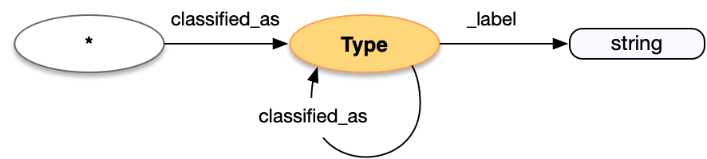

<style>
th, td {
  padding: 5px 5px;
  text-align: left;
  border: 1px solid #D0D0D0; }
th { background: #F0F0F0; }
th:first-child, td:first-child { padding-left: 3px; }
th:last-child, td:last-child { padding-right: 3px; }
</style>

[TOC]

## Introduction

Concepts, called Types, are a core part of the model and present in practically every resource description. They give access to external vocabularies, such as the Getty's Art and Architecture Thesaurus, in order to add classifications to entities described. As they are external entities, rather than the focus of the Linked Art documentation, they are only slightly more detailed than any other [entity reference](../reference/), allowing an additional meta-classification to be asserted about the Type. 

The Type pattern is also used for more specific concept types:

* `Language` is used for human-spoken languages, such as Spanish
* `Material` is used for the materials that make up a physical thing, such as gold
* `Currency` is used for the currency of monetary amounts, such as the Euro
* `MeasurementUnit` is used for the unit of measured dimensions, such as inches

Types are described in the [base patterns](/model/base/#types-and-classifications) of the model documentation, and examples are present for practically every class.

## Property Definitions

### Properties of Types

| Property Name     | Datatype      | Requirement | Description | 
|-------------------|---------------|-------------|-------------|
| `id`              | string        | Required    | The value MUST be a URI identifying the concept |  
| `type`            | string        | Required    | The class of the concept, which MUST be one of the following values: `"Type"`, `"Currency"`, `"Language"`, `"Material"`, or `"MeasurementUnit"` |
| `_label`          | string        | Recommended | A human readable label for the concept, intended for developers |
| `classified_as`   | array         | Recommended | An array of json objects, each of which is a further classification of the concept and MUST follow these requirements for Type |

### Property Diagram

> {:.diagram_img width="600px"}

### Incoming Properties

Types and other instances of concepts are typically found as the object of the following properties.  This list is not exhaustive, but is intended to cover the likely cases.

| Property Name   | Source Class   | Description |
|-----------------|----------------|-------------|
| `classified_as` | All            | Almost every entity can be classified as a Type |
| `technique`     | `Activity`     | Activities (of all sorts) can have a technique, which is modeled as a Type |
| `motivated_by`  | `Activity`     | Activities can also be motivated by a Type |
| `about`         | `LinguisticObject`, `VisualItem` | Textual and Visual Works can have subjects, which are modeled as Types |
| `assigned`      | `AttributeAssignment` | The classification of an object might be assigned as part of a documented Attribute Assignment |
| `language`      | `LinguisticObject`    | The language of linguistic content is modeled as a Language |
| `currency`      | `MonetaryAmount`      | The currency of a MonetaryAmount is modeled as a Currency |
| `unit`          | `Dimension`           | The unit of a Dimension is modeled as a MeasurementUnit |
| `made_of`       | `Material`            | The materials of a HumanMadeObject are modeled as Materials | 


## Example

A painting is classified as a painting, which is in turn classified as a type of work.

* It has an `id` of _aat:300033618_
* It has a `type` of "Type"
* It has a human readable `_label` of "Painting"
* It is classified as a meta-type, which ...
  * ... has an `id` of _aat:300435443_
  * ... also has a `type` of "Type"
  * ... and has a human readable `_label` of "Type of Work"

```crom
top = vocab.Painting()
```


## Extended Definition

If a Type is created by the publishing institution rather than referring to a commonly used, existing vocabulary, then it is useful to provide an extended description of the Type at the URI given in `id`. This is not part of the Linked Art API, but is provided as a recommendation. 

When the URI of the Type is dereferenced as if it were an endpoint, then the following properties are also available in addition to those above.


| Property Name     | Datatype      | Requirement | Description | 
|-------------------|---------------|-------------|-------------|
| `identified_by`   | array         | Recommended | An array of json objects, each of which is either a name of the Type and MUST follow the requirements for [Name](../../shared/name/), or an identifier for the Type and MUST follow the requirements for [Identifier](../../shared/identifier/) |
| `referred_to_by`  | array         | Optional    | An array of json objects, each of which is a human readable statement about the Type and MUST follow the requirements for [Statement](../../shared/statement/) |
| `part_of`         | array         | Optional    | An array of json objects, each of which is a Type that the current Type is narrower than and MUST follow the requirements for an [entity reference](../../shared/reference/) to a Type |
| `member_of`       | array         | Optional    | An array of json objects, each of which is a Set that the current Type is a member of and MUST follow the requirements for an [entity reference](../../shared/reference/) to a [Set](../../endpoint/set/) |


### Extended Example

```crom
top = model.Type(label="GAN Art")
top.classified_as = vocab.instances['work type']
top.identified_by = vocab.LocalNumber(content="186_gan_art")
nm = vocab.PrimaryName(content="Generative Adversarial Network (GAN) Generated Art")
nm.language = vocab.instances['english']
top.identified_by = nm
top.referred_to_by = vocab.Description(content="The generation of art by a process of training a machine learning algorithm to create the art, and a second algorithm to classify it, and then picking the higest classified image.")
top.part_of = model.Type(ident="http://vocab.getty.edu/aat/300069478", label="Computer Art")
```
