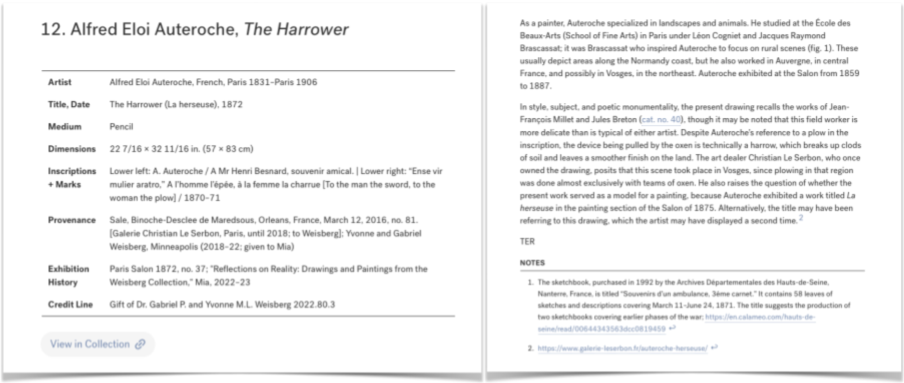
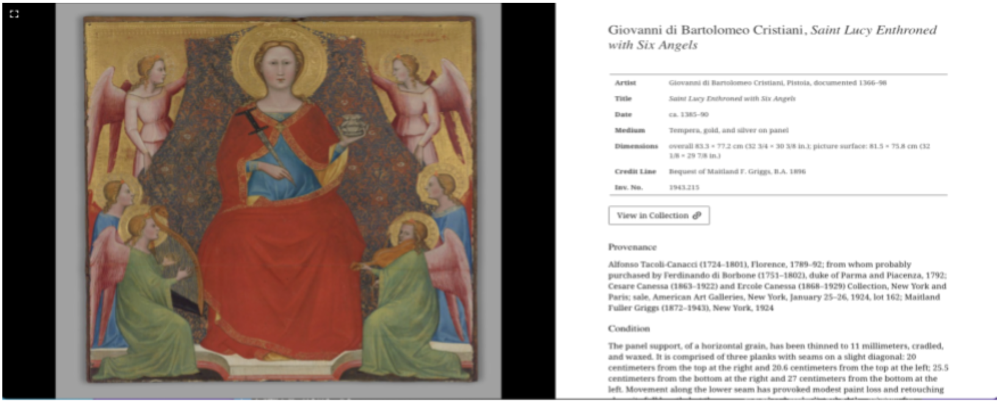
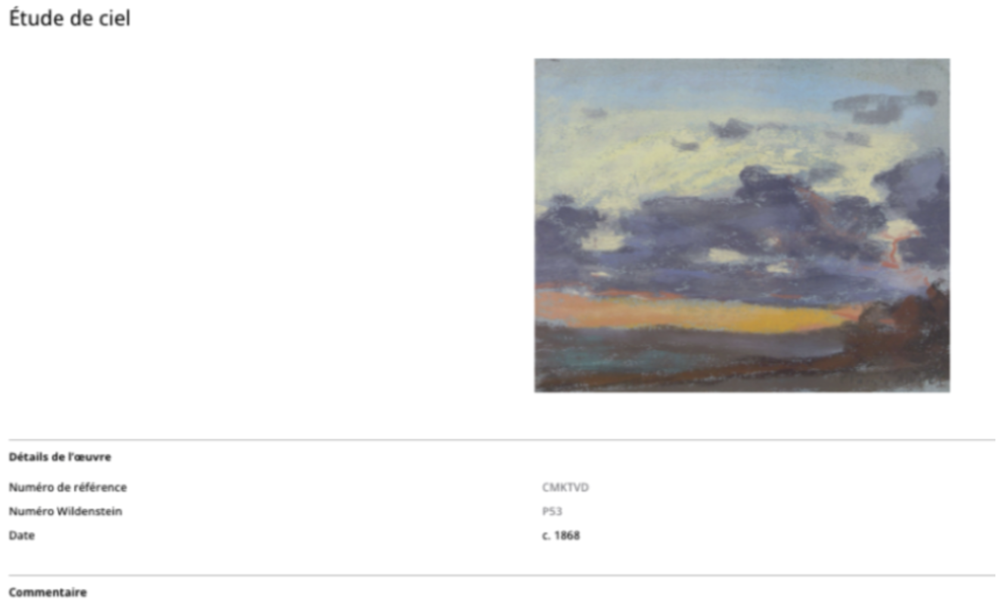
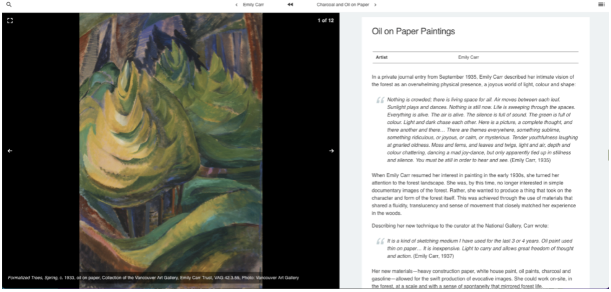
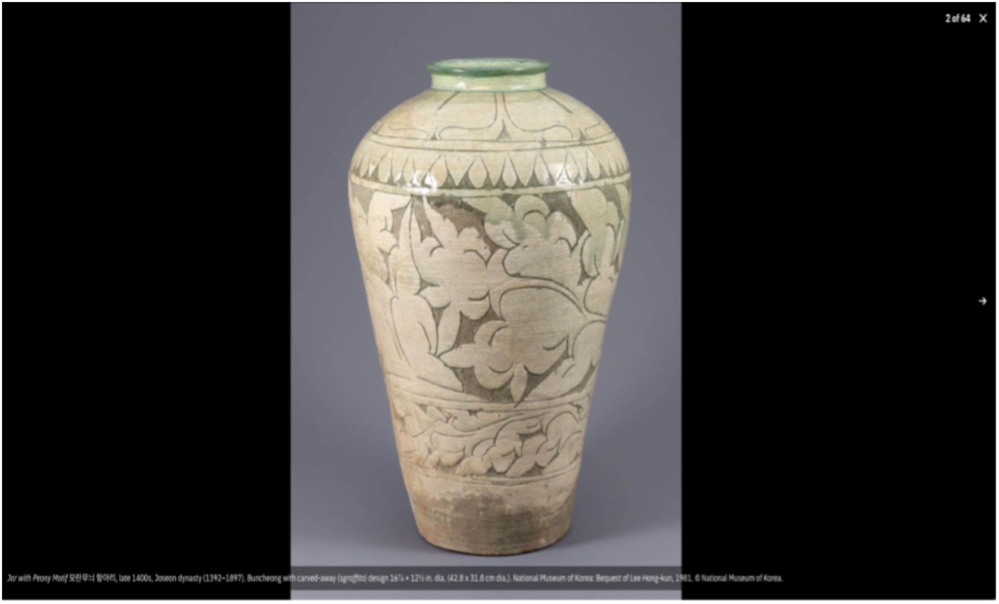
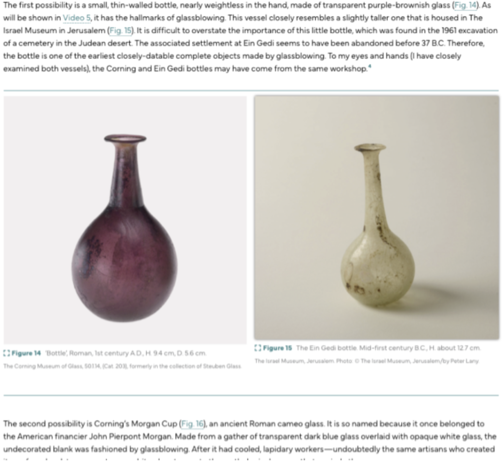
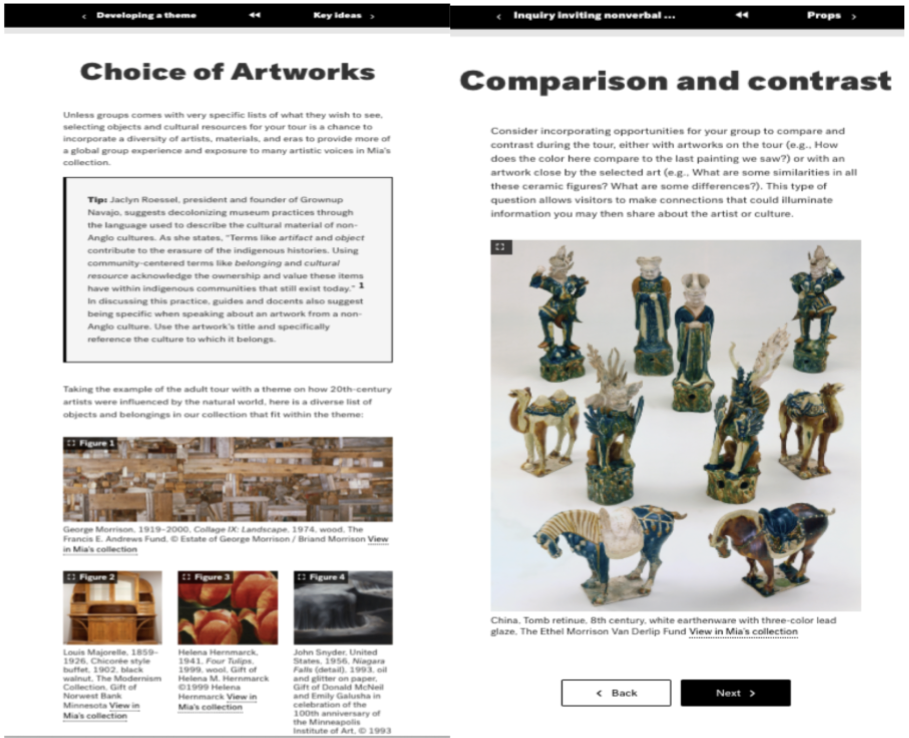

[Back to EES2 Project page](https://linked.art/community/projects/ees2/)

# Linked Art for Quire

## Survey of Community Quire outputs

As of 23 May 2024, there are fourteen distinct genres of Quire output identified by the team at Getty in the [‘Community Showcase’](https://quire.getty.edu/community/community-showcase/) section of their website.1 The page lists 61 separate Quire outputs as of 19 June 2024. This consists of around 80% of extant Quire projects known to the team.2 Several projects linked to on the Community Showcase page are no longer accessible. The first is a self-published 2019 research project, of which only the cover page is functional.3 Three outputs by Hong Kong University have similarly perished.4 The extant outputs are still a valuable resource for investigating the practices of Quire users, and seeing how these might influence future development of the EES2 Quire Linked Art module.5

The genres identified by the team at Getty, examples hyperlinked, are:

[Monograph](https://romanglassblowing.cmog.org/) (2024)  
[Catalogue](https://buncheong.denartmus.org/) (2023)  
[Journal](https://issue-3.materiajournal.com/) (2023)  
[Series](https://digital.pitts.emory.edu/s/digital-collections/item-set/13148) (2023)  
[Proceedings](https://ethiopian-social-contract.northwestern.pub/) (2022)  
[Essay(s)](https://gwu-museum-studies.github.io/Museum-Digital-Practice-2022/) (2022)  
[Report(s)](https://reports.dahvc.org/2021/) (2021)  
[Online Exhibition](http://shencai.lib.hku.hk/) (2021, link broken)  
[Course Handbook](https://catalog.candler.emory.edu/) (2020)  
[Family History](https://catalog.candler.emory.edu/) (2020)  
[Graduate Project](https://ad-hoc-museum-collective.github.io/GWU-museum-digital-practice-2019/) (2019)  
[Research Project](https://mozoomdar-at-sea.netlify.app/) (2019, link broken)  
[Pamphlet](https://artsmia.github.io/tour-toolkit/) (2019)  
[Interactive Publication](https://artsmia.github.io/alcohols-empire/) (2019)  

After analysing the projects listed in the Community Showcase, only those listed as *Catalogue, Journal, Series, Report, Handbook, History and Pamphlet* displayed approaches to structuring their Quire outputs which I consider ‘unique’. (A monograph can be an amalgamation of one or several of these unique styles). Of these, only the ***Catalogue***, ***Journal*** and ***Pamphlet*** categories incorporate images, figures and/or objects in a way that is relevant to Linked Art capabilities, and this survey therefore focuses on these genres as a representative summary of how Quire is being used today. 

Where artwork is concerned, the main distinction to be aware of is that some projects are ***object-focused***, while others are ***figure-focused***. This distinction is discussed below. I have focused on more recent publications as an indication of the present direction of Quire outputs, though older outputs are consulted where relevant, and to illustrate elements of continuity and change within the Quire ecosystem.

### Objects

Object-focused publications tend, almost invariably, to be catalogues. However, Quire catalogues can vary dramatically in the way they represent information about objects. The spectrum ranges from containing almost all metadata within the native Quire tombstone function (accessed via the ‘objects.yaml’ file), to presenting nearly everything discursively in the main body of text. What counts as ‘metadata’, and what as ‘discussion’ of the object’s significance is necessarily subjective. It is nonetheless a useful distinction when it comes to documenting the cataloguing practice(s) of curators. Minneapolis 2023, Yale 2023 and Wildner 2023 are good indicators of the range of object-focused styles utilised by these catalogues. 

[Minneapolis 2023](https://artsmia.org/weisberg-collection/) contains nearly all information about the object within the tombstone data, discussing only biographical details of the artist and the object’s relation to other works within the text body.

<figure style="text-align: center;">
  
  <figcaption>Minneapolis Institute of Art, 2023</figcaption>
</figure>

[Yale 2023](https://italian-paintings-live.netlify.app/) opts for a similar style, but discusses the ‘Provenance’ and ‘Condition’ of the object within the text body instead of within the tombstone fields.

<figure style="text-align: center;">
  
  <figcaption>Yale University Art Gallery, 2023</figcaption>
</figure>

[Wildenstein 2023](https://monet-pastels.wpi.art/) is much more sparing with its tombstone use, only recalling the estimated date and unique identifiers of the object within the tombstone field. All other information about the object is contained within the text body.

<figure style="text-align: center;">
  
  <figcaption>Wildenstein Plattner Institute, 2023</figcaption>
</figure>

### Figures-as-objects

Some catalogues don’t incorporate objects at all, or focus more heavily on figures to convey information about artworks even if the page uses an object structure.
 
[Vancouver 2023](https://fromtheearthexhibition.ca/), only lists a single field under its object page. The exhibition is more interested in processes of production, rather than individual artworks, and so provides a slideshow on the object page consisting of several figures. All of the information one might expect to see on an object tombstone is contained within the figure captions.

<figure style="text-align: center;">
  
  <figcaption>Vancouver Art Gallery, 2023</figcaption>
</figure>

[Denver 2023](https://buncheong.denartmus.org/), an exhibition catalogue, doesn’t use objects at all to structure its catalogue entries. All information about its objects is contained within figure captions.

<figure style="text-align: center;">
  
  <figcaption>Denver Art Museum, 2023</figcaption>
</figure>

### Figures within text body

[Materia 2023](https://issue-3.materiajournal.com/) (a journal of technical art history) and [Corning 2024](https://romanglassblowing.cmog.org/) (a glass-blowing monograph and catalogue) both feature essays. These utilise figures within the text body that relate object information in the figure caption. [Minneapolis 2019](https://artsmia.github.io/tour-toolkit/) (a pamphlet) does the same in a different generic context.

<figure style="text-align: center;">
  
  <figcaption>Corning Museum of Glass, 2024</figcaption>
</figure>

<figure style="text-align: center;">
  
  <figcaption>Minneapolis Institute of Art, 2019</figcaption>
</figure>

### Conclusions

#### State of the field

Tombstones are often used for detailing information about an object. They are also used flexibly. Where this happens, the information that might normally be contained within the tombstone might feature in the figure caption, or in the main text body. 

Artworks are also incorporated as figures. This happens across the spectrum of Quire outputs relevant to Linked Art. In this case, the figure caption field becomes a surrogate tombstone, containing all of the data that would be formatted into separate fields in an object tombstone. Users who wish to incorporate figures in this way would find their lives made easier if the EES2 module expanded the capability of the currently limited `quire add figure` command.

#### Further development

It is possible that the EES2 module will change the direction of future Quire outputs, by making it easier to implement objects as opposed to figures, irrespective of the current state of the field. Quire is an evolving piece of software, and the kinds of output being produced by the Quire community in the last year look markedly less diverse than outputs from 2018 and 2019. These kinds of outputs may become the consensus for what Quire is used for, but there is no guarantee of this. Alternatively, if Quire maintains its popularity, the types of outputs being produced by the end of this decade may look very different from those produced today. This is difficult to predict, and the team at Getty want to allow the Quire software to develop organically. As such the module ought to strive, as far as possible, to avoid pushing users into a certain type of functionality. In an ideal world, the EES2 module will make it easier to create the types of outputs currently predominant, *without* limiting the future possibilities of the software. 

This makes adding the same functionality for figures as objects all the more important. The EES2 module is already useful, with the potential to be even more so. If there is a way to alter the code used for populating object tombstones, to turn those fields into text and concatenate the strings into figure captions, this would give immediate practical benefit to many Quire users.

### Endnotes

1: [https://quire.getty.edu/community/community-showcase/](https://quire.getty.edu/community/community-showcase/) [accessed 19 June 2024]

2: Greg Albers, personal correspondence, 13/5/24

3: [https://mozoomdar-at-sea.netlify.app/](https://mozoomdar-at-sea.netlify.app/) [accessed 19 June 2024]

4: i) [https://digitalpub.umag.hku.hk/jen-bervin/](https://digitalpub.umag.hku.hk/jen-bervin/); ii) [http://shencai.lib.hku.hk/](http://shencai.lib.hku.hk/); iii) [https://digitalpub.umag.hku.hk/textiles/](https://digitalpub.umag.hku.hk/textiles/) [accessed 19 June 2024]

5: The disappearance of these outputs should be examined, since Quire is marketed as a tool for digital preservation. See. [https://quire.getty.edu/downloads/quire-fact-sheet.pdf](https://quire.getty.edu/downloads/quire-fact-sheet.pdf) [accessed 19 June 2024]