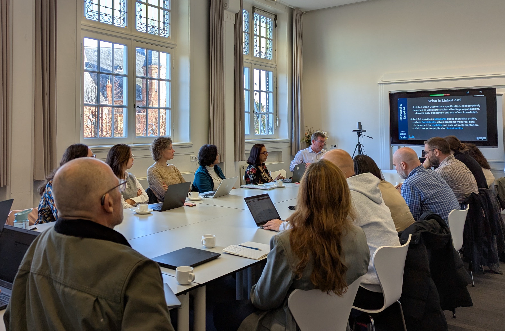
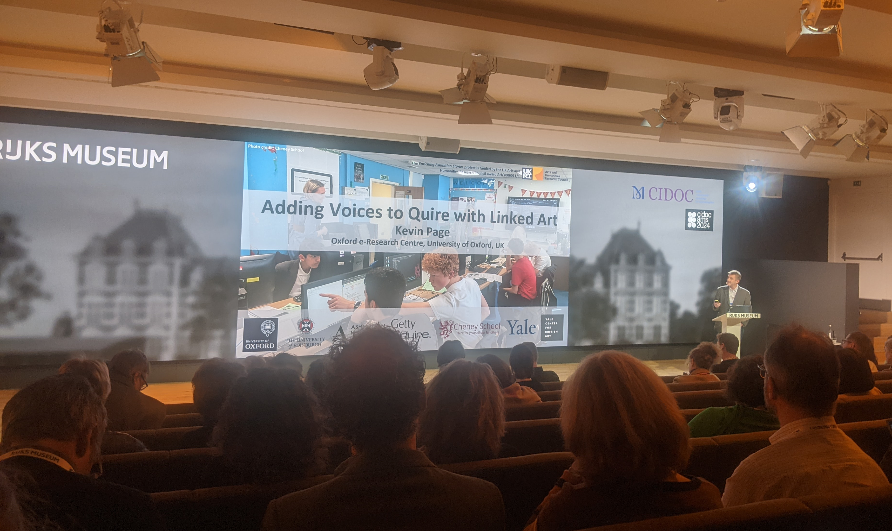
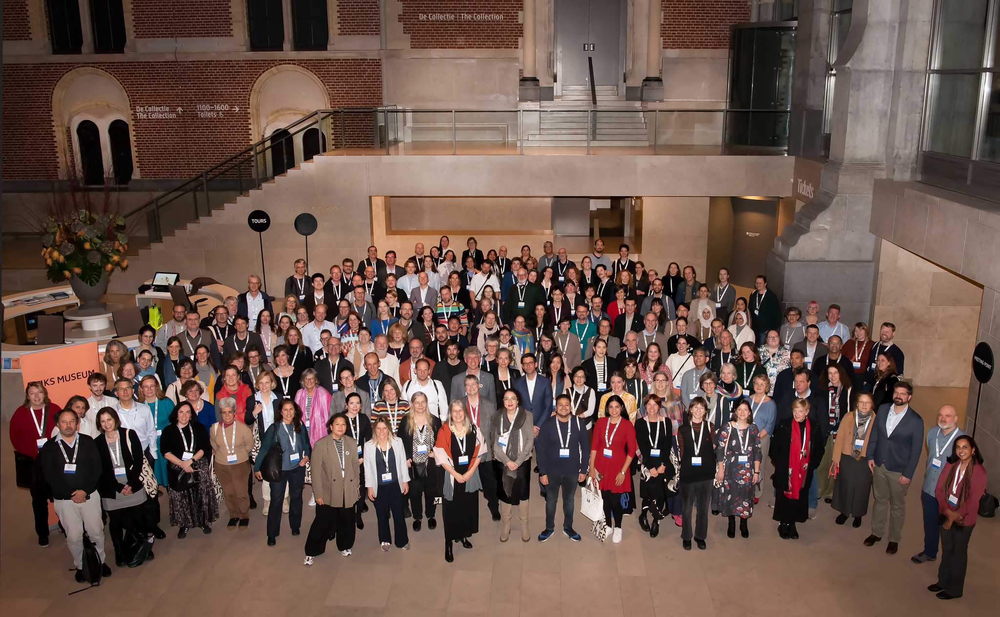

[Back to EES2 Project page](https://linked.art/community/projects/ees2/)

# Enriching Exhibition Stories at CIDOC 2024

The annual CIDOC conference brings together museum professionals through the auspices of the International Council of Museums Committee for Documentation. The November 2024 event was brilliantly organised and hosted by the [Rijksmuseum](https://www.rijksmuseum.nl/) in Amsterdam, with the theme of ‘Sustainable Connections: Building Knowledge Networks’. Around 200 attendees from galleries and museums around the world attended, with a similar number joining online, for a [packed programme](https://www.rijksmuseum.nl/en/whats-on/lectures-symposiums/cidoc2024) exploring the latest in practice and technologies for connecting people to art and history through information and data. The Enriching Exhibition Stories (EES2) project was pleased to be able to disseminate the results of our project to the CIDOC community.

<figure style="text-align: center;">
  
</figure>

The day before the main programme began, we held a conference workshop on ‘Linked Art: Usable Cultural Heritage Linked Data’ for 20 people, with co-organisers including the EES2 UK and US principal investigators and Linked Art Editorial Board members, Kevin Page (Oxford) and Rob Sanderson (Yale, also chair of the Linked Art Editorial Board). The workshop stepped through the Linked Art standard including examples from existing implementations and conceptual modeling exercises.

<figure style="text-align: center;">
  
</figure>

Then on the final day of the conference, Kevin Page (Oxford) presented [PDF](https://www.google.com/url?q=https://drive.google.com/file/d/1DSJ9YDrYP6PnhtnGXVFO2hPa-HadqkdE/view?usp%3Dsharing&sa=D&source=docs&ust=1732792758979104&usg=AOvVaw1Bgi1W_9PClBuZEIYVN-pk) the Quire extension developed by the project alongside the results of two project trials using Quire, all of which are now available for re-use on the [project website](https://linked.art/community/projects/ees2/). The first trial reused exhibition materials to [create an educational resource](https://linked.art/community/projects/ees2/docs/labyrinth/) for the Ashmolean Museum; the second trial worked with Cheney School and the Rumble Museum to create a [programme of outreach and teaching activities](https://linked.art/community/projects/ees2/docs/outreach/) embedding story-telling, museum documentation and structured data approaches within history and computing lessons for secondary school children.

<figure style="text-align: center;">
  
  <figcaption>IDOC 2024 group photo © www.moniquekooijmans.nl</figcaption>
</figure>
