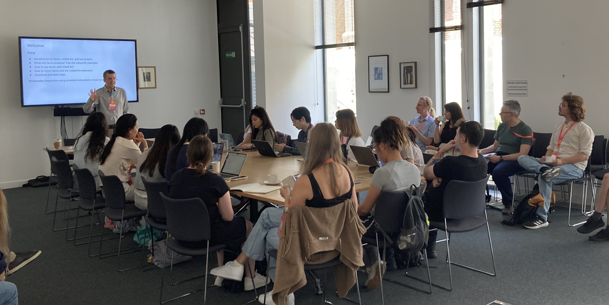
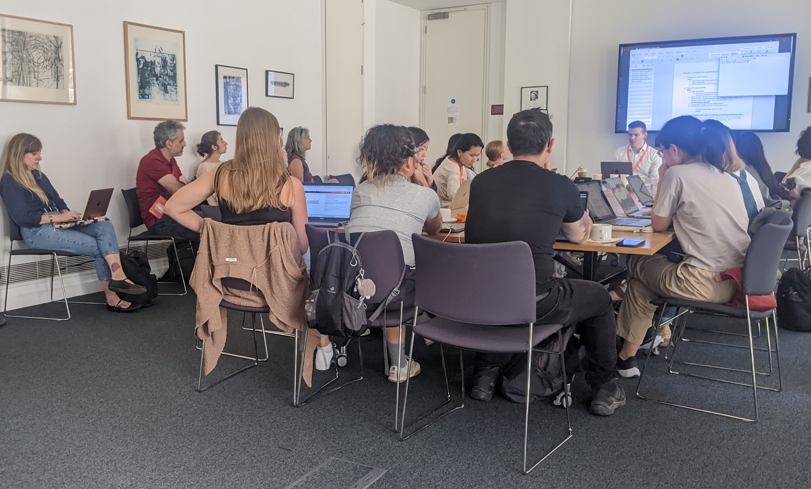
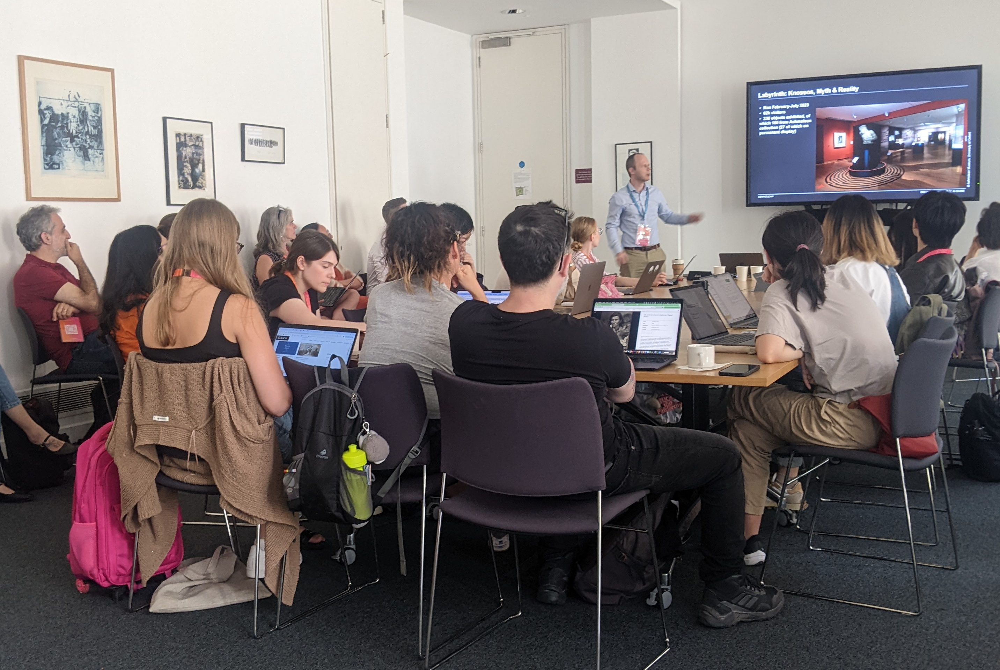

[Back to EES2 Project page](https://linked.art/community/projects/ees2/)

# Train-the-trainer at DHOxSS

In August 2024 the Enriching Exhibition Stories team ran a ‘train-the-trainer’ workshop at the Digital Humanities at Oxford Summer School (DHOxSS), held at St. Anne’s College.

<figure style="text-align: center;">
  
</figure>

Earlier in 2024 the project competitively awarded four Enriching Exhibition Stories Bursaries to support the attendance of museum and gallery professionals at DHOxSS. Alongside our bursary holders, the workshop was attended by 23 other DHOxSS delegates.

The workshop was held across two separate sessions within the DHOxSS programme, with Quire installation support offered to attendees in between.

<figure style="text-align: center;">
  
</figure>

In the first session on Tuesday, attendees were introduced to Getty’s Quire software for digital publication, and then the EES2 extension written by Dr. Tyler Bonnet. The extension takes a Linked Art identifier provided by a user, which it uses to fetch and add museum object data to the user’s Quire project, both for individual objects or a set of objects associated with an activity such as an exhibition. Dr. Bonnet stepped attendees through a worked example of using the extension.

[An example of Quire use](https://linked.art//community/projects/ees2/docs/labyrinth/) in museums was presented by Dr. Andrew Shapland, who explained how he reused materials created for his 2023 exhibition at the Ashmolean in learning resources for the permanent Aegean World gallery.

<figure style="text-align: center;">
  
</figure>

In the second session, held on Thursday, attendees worked through hands-on exercises to create digital outputs using Quire and the Linked Art extension, which they had installed on their laptops. All tutorial material and worksheets are available for reference and modification on the [EES2 training website](https://linked.art/community/projects/ees2/docs/training/).