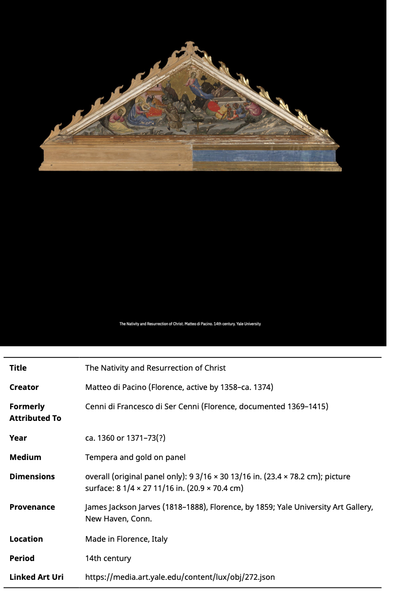
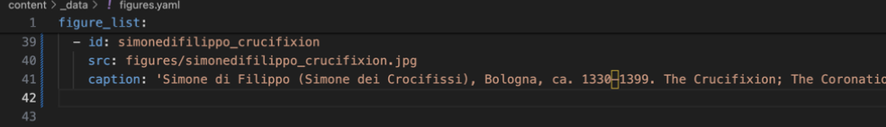

Over the course of two months with EES2 (Enriching Exhibition Stories), I evaluated the effectiveness of the EES2 Linked Art module for Getty's Quire. The EES2 module was in version 0.6 at the time of my involvement with the project. As of [DAY THIS GOES LIVE] it is at 0.7. As part of this it was necessary to understand how people use the Quire software, something which no one outside of the Getty has yet attempted to do. My evaluation lays the groundwork for the EES2 module's future development. This was an exciting period; EES2 is being developed at a time when the user-base of Quire is rapidly expanding. In the time since I finished my practicum alone (just over two months), five new Quire outputs have been featured on the Getty's Quire 'Community Showcase’ page (Getty 2024). In the first six months of 2024 only one output was featured. As Quire continues to develop and to find new audiences, understanding who those audiences are, and what their use-needs are becomes all the more important to evaluating the effectiveness of software extensions like the EES2 module. Overall, the EES2 module is a very useful extension for the Quire software. The specific complications of the module should nevertheless be highlighted.

For those that do not know, Quire is a digital publishing tool, developed by the Getty. It is powered by a static site generator (11ty), several JavaScript programs, and IIIF (International Image Interoperability Framework). The user creates their own Quire output by editing Markdown and YAML code, which are respectively plain-text markup and data-serialisation languages. The team at the Getty want to keep Quire as non-prescriptive as possible (Enriching Exhibition Stories 2024). The developers do not want the structure of the Quire software to necessarily dictate the kinds of output which Quire users can, or tend to produce. This understanding extends to any extensions being developed for Quire. The clearest way to avoid being overly prescriptive while still creating a tool which is helpful to the user community is to understand the structure of existing Quire outputs. These are not necessarily indicative of the future direction of the field, but are indicative of current trends in Quire: by understanding these we root the development of the EES2 module in things that are actually happening in the user community today. This blog post identifies how the EES2 module engages with the state of the field in a way which adds value to creators currently working in Quire, highlighting issues and areas for future development.

I have already surveyed the types of Quire outputs most relevant to the EES2 module. That survey is available here. Getty identify fourteen analytic ‘genres’ on their Community Showcase page (Getty 2024). My survey finds that this categorisation can be condensed significantly within the dimensions of EES2. I focus solely on Quire outputs relevant to Linked Art capabilities. Linked Art is a shared framework for transcribing metadata about cultural heritage objects, built on the principle of Linked Open Usable Data. This enables large-scale data visualisation and integration projects to take place. Without a Linked Art foundation, it would be very difficult, nigh impossible to create the kind of module which the EES2 project is developing. Importing artworks into Quire is the main functionality of the EES2 module, so in practice my condensed categorisation only deals with outputs which rely on artefacts that can be, or have been mapped to Linked Art standards. Quire projects do not have to use any artwork, or even any images, but the ease and customisability with which this can be done is increasingly making Quire a favourite for users in the orbit of art and visual history.

Within relevant Quire outputs I discern two distinct frameworks of image use on a Quire page. A description of the frameworks of use follows, before I analyse the significance of the EES2 module for users working within these frameworks.

The first framework of use is object-focused. Object-focused outputs tend to be exhibition catalogues, which import, per page, one object (typically some form of visual media), alongside ‘tombstone’ fields containing metadata about that object. For example: 

<figure>
  
  <figcaption>Image incorporated as an object in a Quire output.</figcaption>
</figure>

The 'tombstone' is the table of information which accompanies the object. This table of information can contain various pieces of metadata. The underlying Quire YAML (data-serialisation) is split across several lines of code, each corresponding to a different tombstone field. It looks like this:

<figure>
  
  <figcaption>Fig. 2. YAML code underpinning object in a Quire output.</figcaption>
</figure>

The second framework of use is figure-focused. An example of a figure-focused output is an essay related to art or cultural heritage. This might import multiple figures within a single page, each with a ‘caption’ field containing the information which the tombstone fields contain for objects. The output and the underlying code look like this:

<figure>
  
  <figcaption>Fig 3. Image incorporated as a figure in a Quire output.</figcaption>
</figure>

<figure>
  
  <figcaption>Fig. 4. YAML code underpinning figure in a Quire output.</figcaption>
</figure>

It is not uncommon for a single Quire output to incorporate both objects and figures, but it is still worth defining these as distinct frameworks. Although both the object and figure can contain identical metadata, this differs in the way it is structured in the underlying code. For an object, information is split across several fields in the YAML; for a figure it is condensed to fit within a single caption field. This means that incorporating the same image into Quire can actually result in a very different production process depending on how the author wants to display that image within the final Quire publication.

In order to demonstrate the benefits of the EES2 module for each of these frameworks of use I created two separate Quire outputs. These outputs each detail the process of importing images in the style of both frameworks of use. One of these outputs was made with the EES2 module and one without. These Quire outputs enabled me to test the process for implementing these distinct frameworks of use—object-focused and figure-focused—in 'Vanilla' (core) as opposed to 'Modded' (EES2) Quire.

To understand how and whether the EES2 module benefits users working in each of these frameworks of use, I compared the amount of code required for importing objects and figures in Vanilla and Modded Quire. To create an object in Vanilla Quire (assuming nine ‘tombstone’ fields), the user must navigate to the artwork’s catalogue page, download the image into a folder, and write 20 lines of code. This consists of 12 lines in object YAML (expanding or contracting with the number of tombstone fields), 6 lines in figure YAML, and 2 in the Markdown page. To create the same object using the EES2 module, the user must navigate to the artwork’s catalogue page, copy the link to the Linked Art manifest and write 3 lines of code. That is 1 line in the Command Line Interface (CLI) and 2 lines in the Markdown page. In theory the object could be published after writing only these three lines of code, but in practice further manual editing is always required. Nevertheless, code-for-code the EES2 module is more than six times as efficient as core Quire at importing an object (with nine fields). The module becomes more practical the more fields it retrieves.

Ironically, this is why the version of the module which was tested does not significantly benefit users working with figures, since these only ever display, at most, two YAML fields. For a figure in Vanilla Quire, the user must navigate to the artwork’s catalogue page, download the image into a specific folder, and write 6 lines of code in the figure YAML. Using Modded Quire to import a figure, the user navigates to the artwork’s catalogue page, copies the link to the Linked Art manifest and enters one command in the CLI. While this looks like a sixfold increase in efficiency, figure YAML requires that all metadata be manually imported into a single field; in the tested version the module does not import any metadata into the figures YAML. The main benefit of the module for figure-focused outputs is therefore the fact that users of the module do not have to fidget with image asset folders in their project files. Users working in object-focused genres will benefit significantly more from the module—especially those who utilise many tombstone fields. The practical benefit of this early version of the module for figure-focused outputs is limited.

It is worth detailing that the module also encountered numerous issues during my testing. These were partly debugging errors, which are to be expected with a module in alpha-testing. Practical issues I encountered tended to involve manual adjustment of fields in the various YAML files. These issues can be addressed as the module continues to develop. However, users also have to grapple with epistemological data-related issues. The module is not uncomplicated, and the data it retrieves are not unproblematic. There are profound issues related to the types of data which the module retrieves and which databases it can fluently search. The module is chiefly compatible with Yale University’s LUX, a discovery-driven database which prioritises standardisation over nuanced data. Another student undertaking their MSc Digital Scholarship practicum has developed an extension [LINK] to generalise retrieval across Linked Art databases, but regardless of what database is used, the objects which the module imports should not be treated as publication-ready, and both the fields and their content should be criticised for their relevance and accuracy. The ideal user of the module will have enough technical skill in Quire to go beyond the direct affordances of the module and address basic manual customisation of the data that the module retrieves or fails to retrieve. The nature of the EES2 module necessitates that the final user possess a degree of curatorial and editorial acumen.

These issues are not anathema. Tellingly, the Vanilla output also experienced some issues when importing objects. Both Vanilla and Modded outputs encountered errors when engaging with core Quire code, highlighting the fact that Quire already presupposes of its users a relatively high degree of technical proficiency. It is not an overly complex software to learn, but it must be learned. Other digital projects have shown that humanists can only seriously query digital tools when they understand how these tools function on a technical level (Burrows et al. 2021) This is reflected in the deliberate absence of a Graphical User Interface (GUI) in Quire.

In future, many Quire users would benefit from the ability to import Linked Art objects as ‘figures’ with tombstone data translated into a ‘caption’ for the figure. All outputs I surveyed—even those which are ostensibly object-focused—implemented artworks as figures in some way. It is possible that the EES2 module will change the direction of future Quire outputs, by making it easier to implement objects as opposed to figures. Quire is an evolving piece of software, and the kinds of output being produced by the Quire community in 2024 look markedly less diverse than outputs from 2018 and 2019, being almost exclusively exhibition catalogues and art-history journals. This seems to be becoming the consensus for what Quire is used for, but there is no guarantee that this consensus will remain so. If Quire stays popular, the types of output being produced in five years time may look very different from those produced today. The team at the Getty want to allow Quire to develop organically, so the EES2 module will strive, as far as possible, to avoid pushing users into a certain type of functionality. Hopefully, the EES2 module will make it easier to create the types of outputs currently predominant, without limiting the future possibilities of the software. 

One way it can do this in future is by expanding the functionality that currently exists for object-import to figures. The EES2 module is already useful, with the potential to be even more so. Slightly adapting the code currently used for populating object tombstones with Linked Art information will make it possible to turn those Linked Art fields into text and concatenate the strings so that they fit inside the single field of a figure caption. This will ensure the module sticks to the Getty’s anti-prescriptivist aims, as well as providing immediate practical benefit to many Quire users.

Overall, the EES2 module is at present a fantastic quality-of-life improvement for users working within object-focused Quire outputs, especially when a catalogue contains a great number of pages devoted to individual artworks, themselves containing many tombstone fields. The module presupposes familiarity with Quire and the interpretive nature of cultural data, but this is by design.

 Supporting documentation for the EES2 module is being created, incorporating the work I contributed during my two months with the project. Structured data import for figures, as exists for objects, has been added to the development wishlist. I would like to thank my colleagues at EES2 and the Getty for their support over the two months I was with the project, which gave me the resources to contribute meaningfully to the EES2 project. Dr. Kevin Page, Dr. Tyler Bonnet, David Lewis, Erin Canning and Sasha Tan variously provided supervision and a stimulating and enjoyable work environment.

## Citations

- Burrows, Toby, Laura Cleaver, Doug Emery, Mikko Koho, Lynn Ransom, and Emma Thomson. “Using SPARQL to Investigate the Research Potential of a Linked Open Data Knowledge Graph: The Mapping Manuscript Migrations Project”, 2021. [doi:10.5281/ZENODO.5106318](https://doi.org/10.5281/zenodo.5106318).
  
- Thorsteinn Imi King. “Linked Art for Quire: A Survey of Community Quire Outputs.” *Enriching Exhibition Stories*, forthcoming.
  
- Enriching Exhibition Stories. “EES2 Development Tasks and Priority Use Cases.” Minutes of EES2 meeting, 3 June 2024, The Getty Villa.
  
- Getty. “Community Showcase.” *Quire™*, 2024. <https://quire.getty.edu/community/community-showcase/> [accessed 19 June 2024].